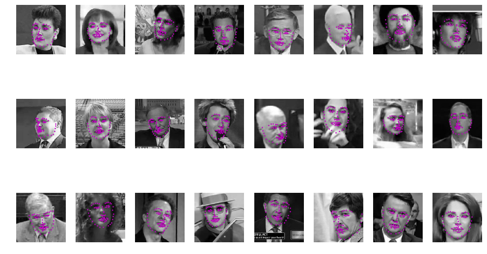
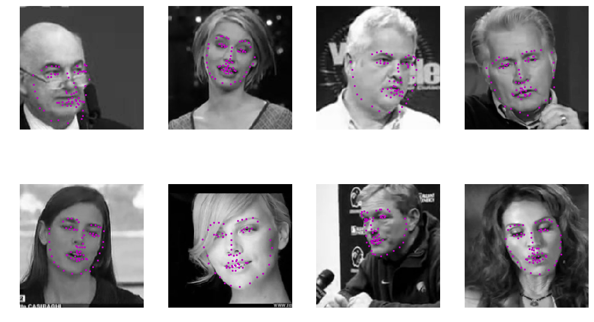
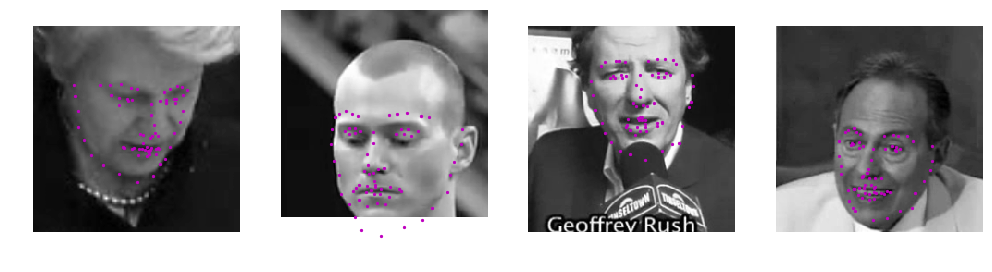
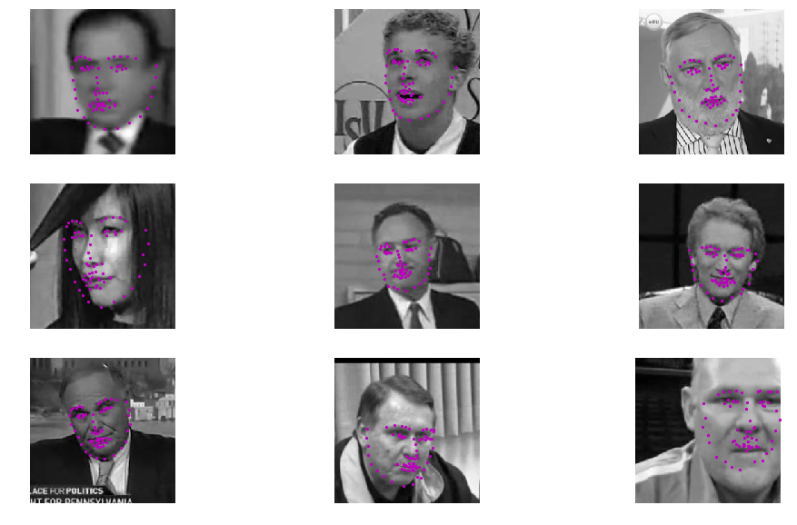
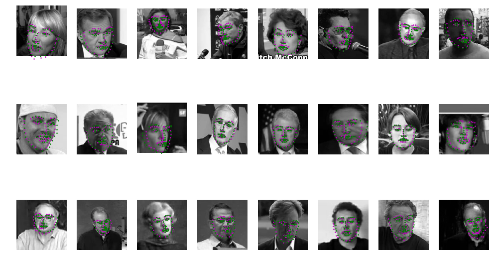
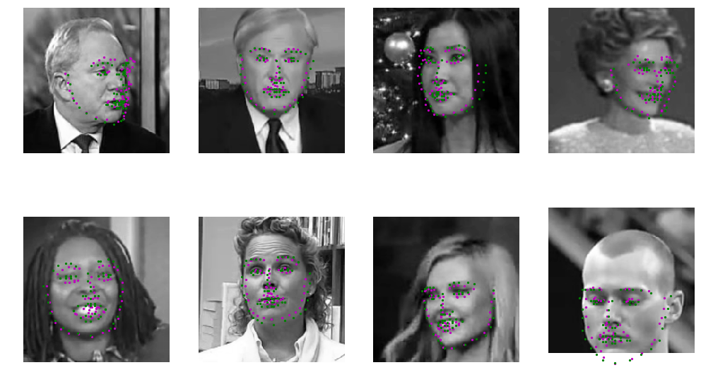

# Facial Landmarks Detection

Implemented and trained a Conolutional Neural Network to predict facial landmarks.

## Inference Showcase

Model prediction of facial landmarks for random faces.

Model prediction of facial landmarks for random faces compared against expected(ground truth). Model prediction markers are in magenta, and ground truth markers are in green.

