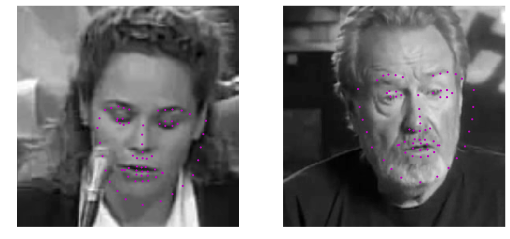
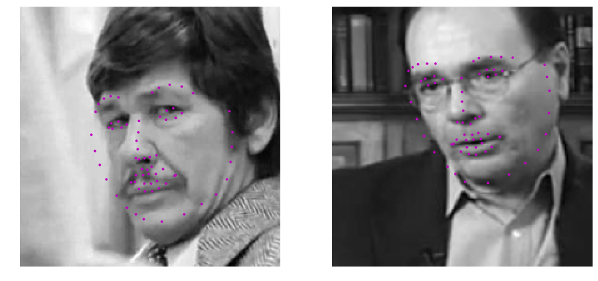
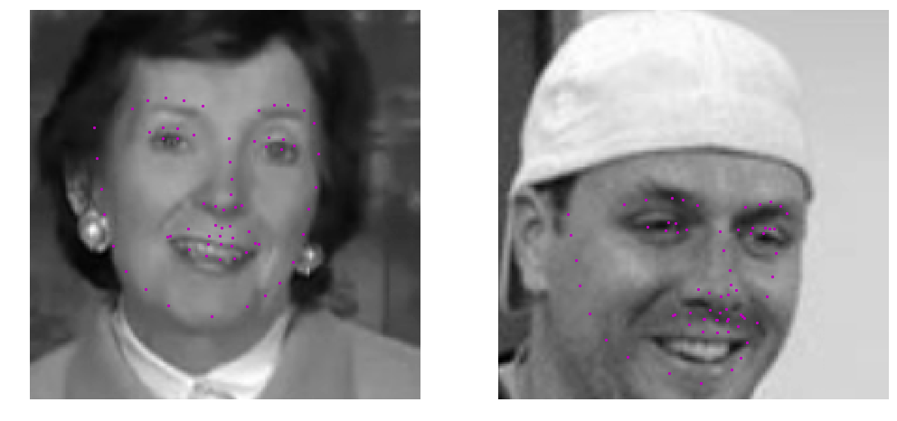
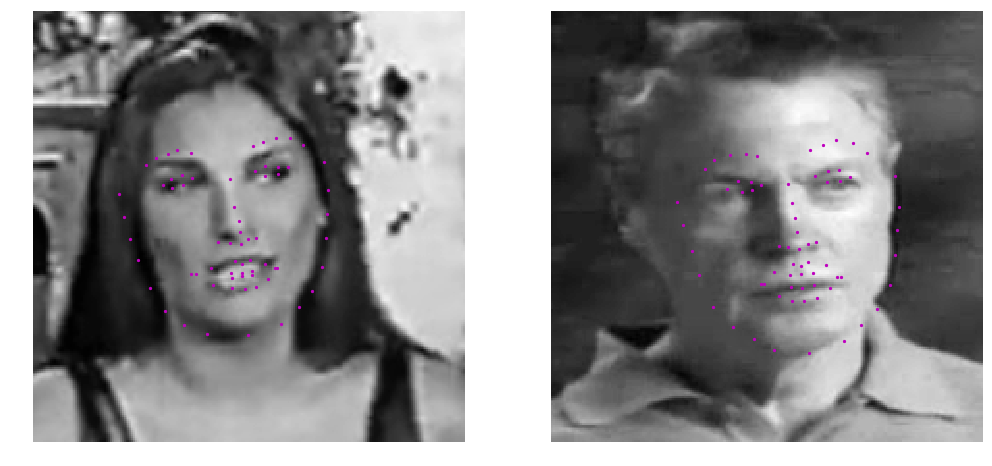

# Facial Landmarks Detection

Implemented and trained a Conolutional Neural Network to predict facial landmarks.

A preview of model training and evaluation is available [here](training1/Model_Training_and_Evaluation.md).

