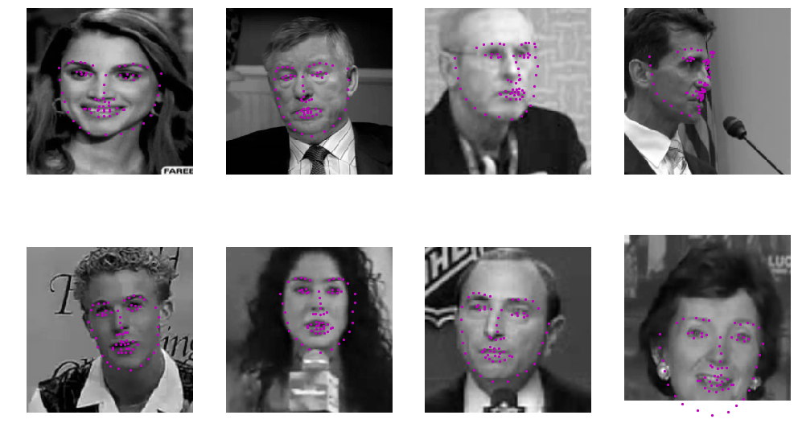
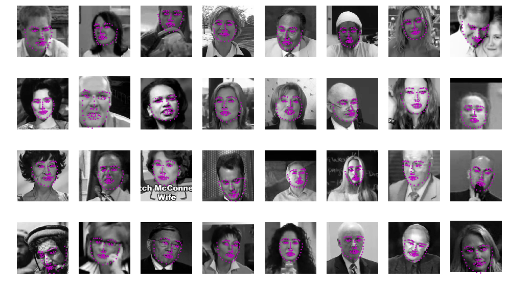
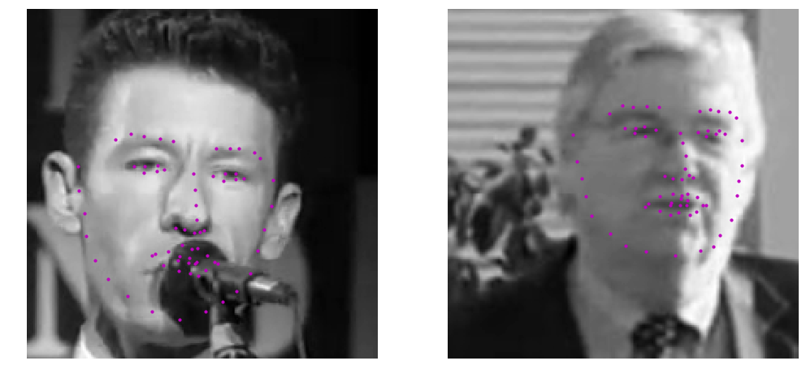
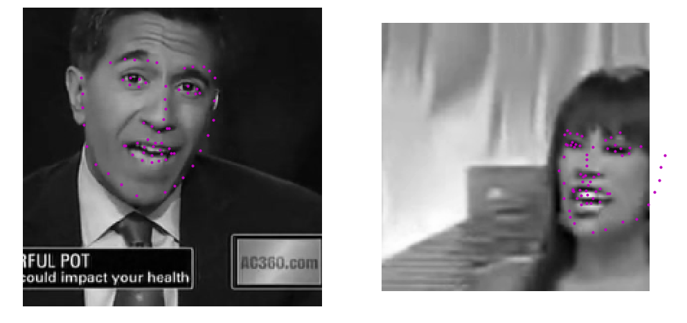
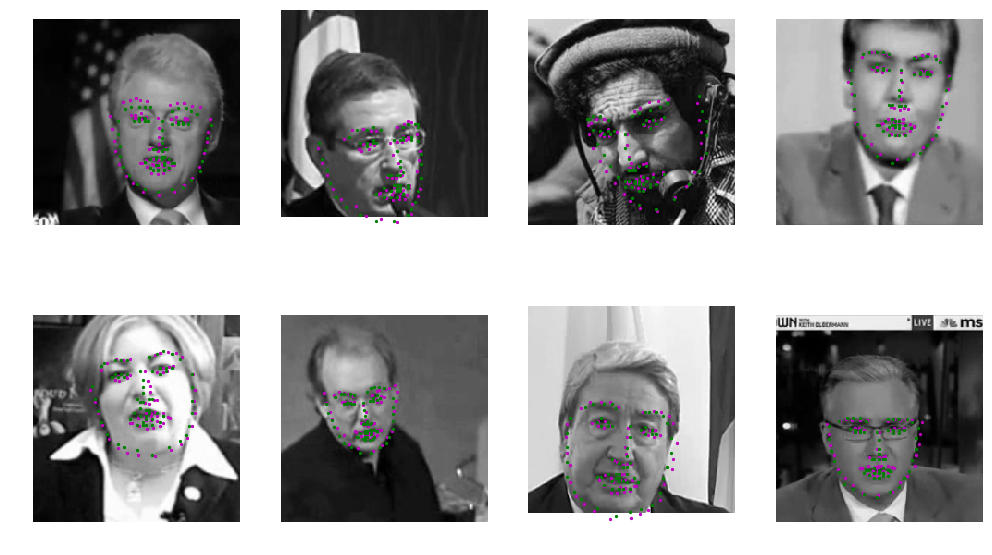
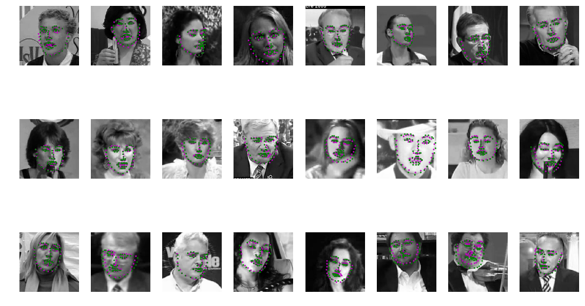

# Facial Landmarks Detection

###### Victor Mawusi Ayi

Implemented and trained a Convolutional Neural Network to predict facial landmarks.

## Contents

Find out more about this project from these links below:

+ [First Training Round](training1/Model_Training_and_Evaluation.md)

+ [Second Training Round](training2/model_training2.md)

+ [Third Training Round](training3/model_training3.md)

+ [Inference/Predictions with Best Trained Model after Second Training Round](inference/inference.md)

+ [Inference/Predictions with Best Trained Model after Third Training Round](inference2/inference.md)

## Inference Showcase

##### Model prediction of facial landmarks for random faces.

##### Model prediction of facial landmarks for random faces compared against expected(ground truth). 

Model prediction markers are in magenta, and ground truth markers are in green.

