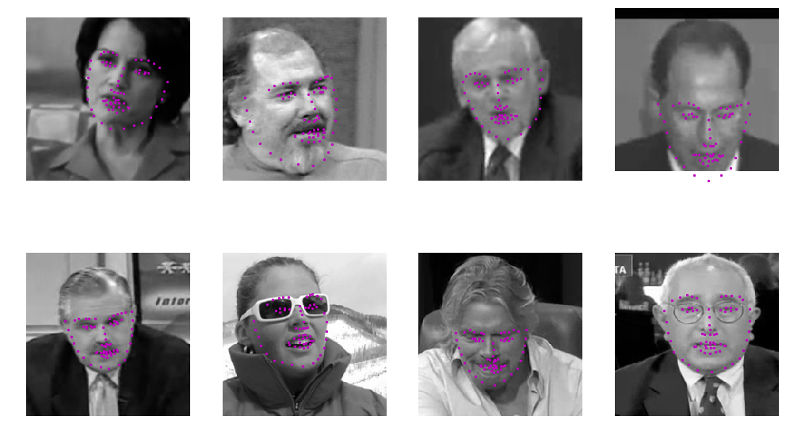
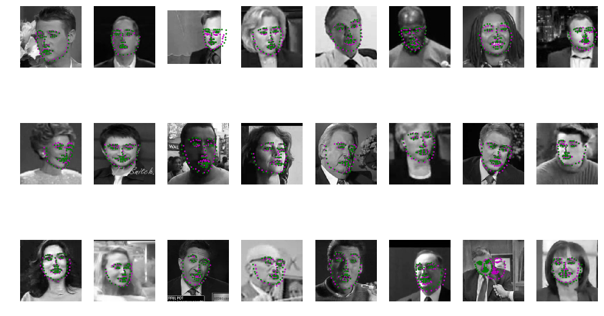
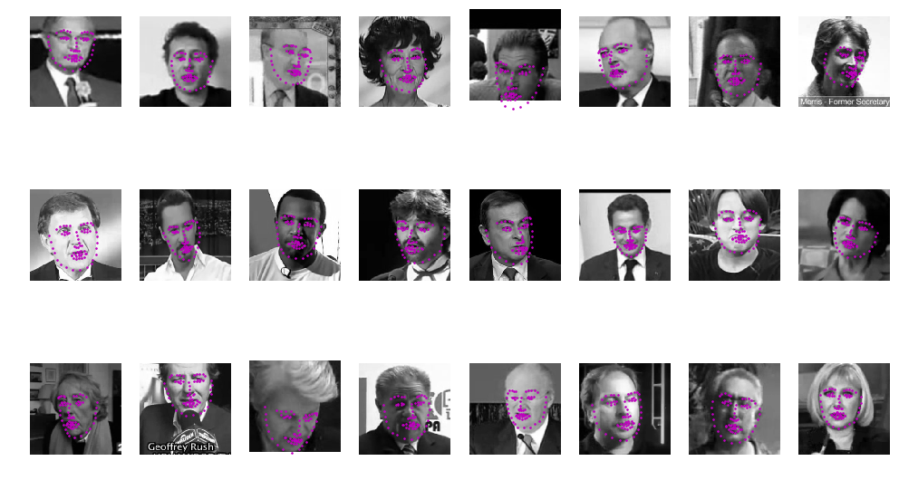
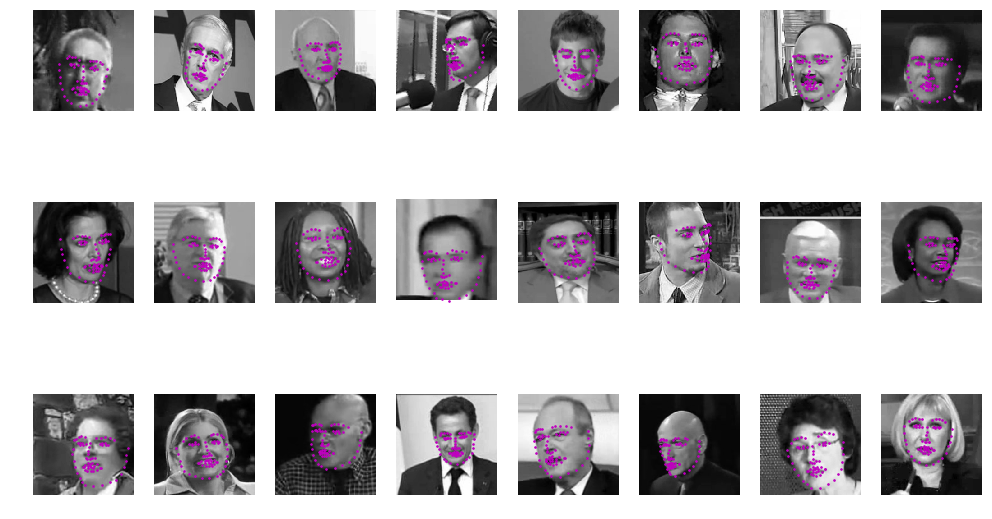
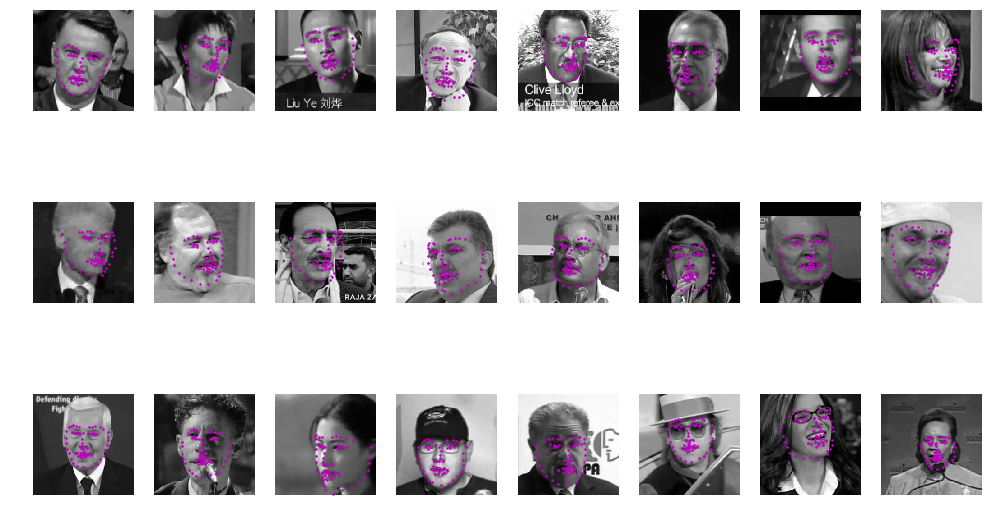
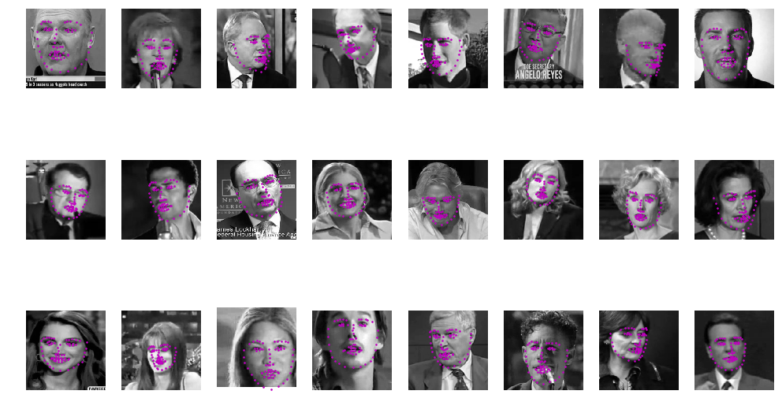
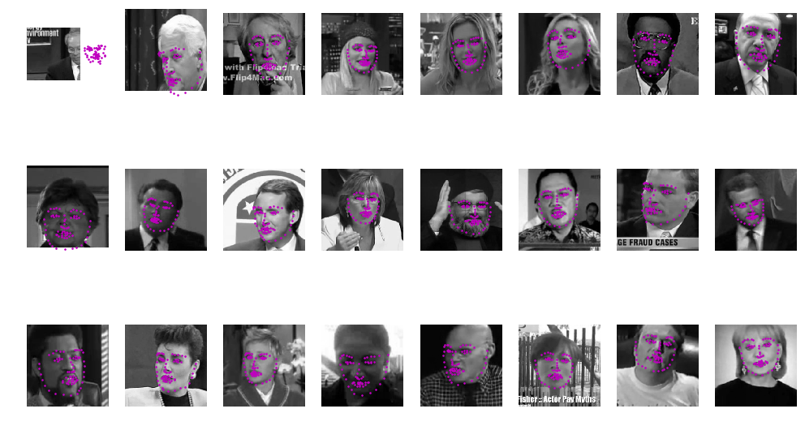
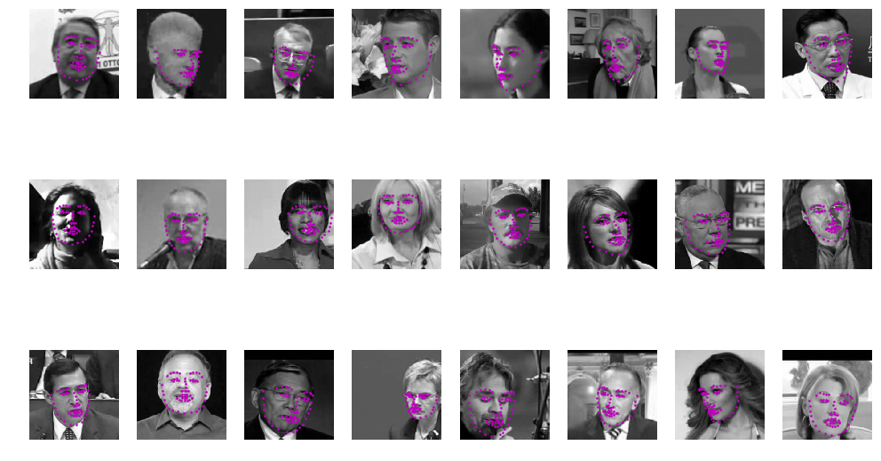
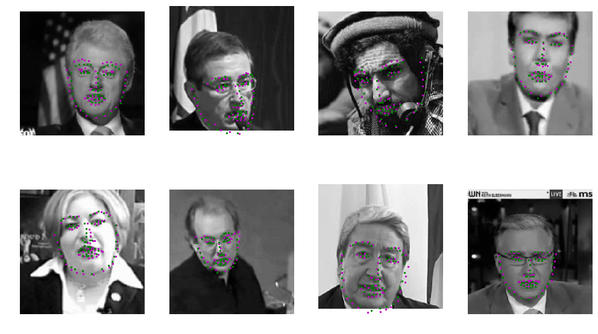
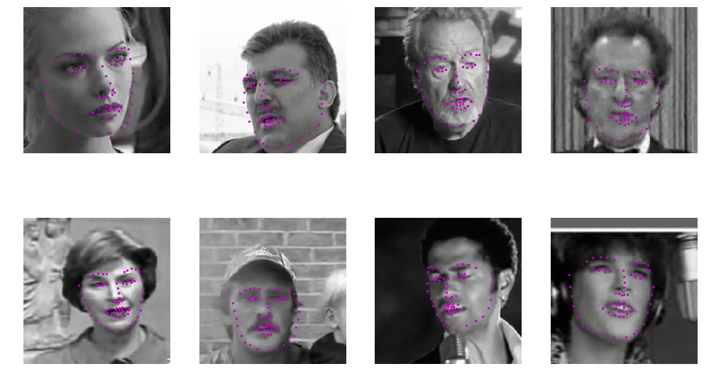

# Testing Model and Running Predictions

### Staging Model and Downloading Data


```python
import matplotlib.pyplot as plt
import torch

from loaders import testloader, test_dataset
from models import Net3
from training import fit
from visualization import plotter
```


```python
# load the data if you need to; if you have already loaded the data, you may comment this cell out
# -- DO NOT CHANGE THIS CELL -- #
!mkdir /data
!wget -P /data/ https://s3.amazonaws.com/video.udacity-data.com/topher/2018/May/5aea1b91_train-test-data/train-test-data.zip
!unzip -n /data/train-test-data.zip -d /data
```

    mkdir: cannot create directory ‘/data’: File exists
    --2019-12-29 13:10:17--  https://s3.amazonaws.com/video.udacity-data.com/topher/2018/May/5aea1b91_train-test-data/train-test-data.zip
    Resolving s3.amazonaws.com (s3.amazonaws.com)... 52.216.241.54
    Connecting to s3.amazonaws.com (s3.amazonaws.com)|52.216.241.54|:443... connected.
    HTTP request sent, awaiting response... 200 OK
    Length: 338613624 (323M) [application/zip]
    Saving to: ‘/data/train-test-data.zip.2’
    
    train-test-data.zip 100%[===================>] 322.93M  72.8MB/s    in 4.5s    
    
    2019-12-29 13:10:22 (72.0 MB/s) - ‘/data/train-test-data.zip.2’ saved [338613624/338613624]
    
    Archive:  /data/train-test-data.zip


```python
device = torch.device("cuda" if torch.cuda.is_available() else "cpu")
```


```python
batch_size = 10

test_dataset = test_dataset()

test_loader = testloader(batch_size)
test_loader_val = testloader(1)
```


```python
model_save_name = "bestNet3a1.pt"

modelbest = Net3()
modelbest.load_state_dict(torch.load(model_save_name))
modelbest.to(device)
```


    Net3(
      (conv1): Conv2d(1, 8, kernel_size=(5, 5), stride=(1, 1), padding=(2, 2))
      (conv2): Conv2d(8, 16, kernel_size=(5, 5), stride=(1, 1), padding=(2, 2))
      (conv3): Conv2d(16, 32, kernel_size=(5, 5), stride=(2, 2))
      (conv4): Conv2d(32, 64, kernel_size=(3, 3), stride=(1, 1), padding=(1, 1))
      (conv5): Conv2d(64, 128, kernel_size=(3, 3), stride=(1, 1), padding=(1, 1))
      (conv6): Conv2d(128, 256, kernel_size=(3, 3), stride=(1, 1), padding=(1, 1))
      (conv7): Conv2d(256, 512, kernel_size=(3, 3), stride=(1, 1), padding=(1, 1))
      (conv8): Conv2d(512, 512, kernel_size=(3, 3), stride=(1, 1), padding=(1, 1))
      (conv9): Conv2d(512, 1024, kernel_size=(3, 3), stride=(1, 1), padding=(1, 1))
      (dense1): Linear(in_features=1024, out_features=1024, bias=True)
      (dense2): Linear(in_features=1024, out_features=136, bias=True)
      (pool): MaxPool2d(kernel_size=2, stride=2, padding=0, dilation=1, ceil_mode=False)
      (drop): Dropout(p=0.3)
    )


### Running Facial Keypoint Predictions 

#### Zooming in on predictions (Not showing actual Keypoints or ground truth)


```python
plotter(modelbest, test_loader, plotrows=2, plotcolumns=4, showactual=False)
```





#### Zooming in on predictions (In comparison with actual Keypoints or ground truth)


```python
plotter(modelbest, test_loader, plotrows=2, plotcolumns=4, showactual=True)
```


#### More predictions (in comparison with Actual Keypoints or Ground Truth)


```python
plotter(modelbest, test_loader, plotrows=3, plotcolumns=8, showactual=True, markersize=10)
```





#### More predictions (Not showing actual Keypoints or ground truth)


```python
plotter(modelbest, test_loader, plotrows=3, plotcolumns=8, markersize=10)
```





```python
plotter(modelbest, test_loader, plotrows=3, plotcolumns=8, markersize=10)
```





```python
plotter(modelbest, test_loader, plotrows=3, plotcolumns=8, markersize=10)
```





```python
plotter(modelbest, test_loader, plotrows=3, plotcolumns=8, markersize=10)
```





```python
plotter(modelbest, test_loader, plotrows=3, plotcolumns=8, markersize=10)
```





```python
plotter(modelbest, test_loader, plotrows=3, plotcolumns=8, markersize=10)
```





```python
plotter(modelbest, test_loader, plotrows=2, plotcolumns=4, showactual=True)
```





```python
plotter(modelbest, test_loader, plotrows=3, plotcolumns=8, markersize=10, showactual=True)
```


```python
plotter(modelbest, test_loader, plotrows=2, plotcolumns=4, showactual=False)
```





```python
plotter(modelbest, test_loader, plotrows=2, plotcolumns=4, showactual=False)
```


```python
plotter(modelbest, test_loader, plotrows=1, plotcolumns=2, showactual=False, markersize=40)
```


```python
plotter(modelbest, test_loader, plotrows=1, plotcolumns=3, showactual=True, markersize=30)
```


```python

```
