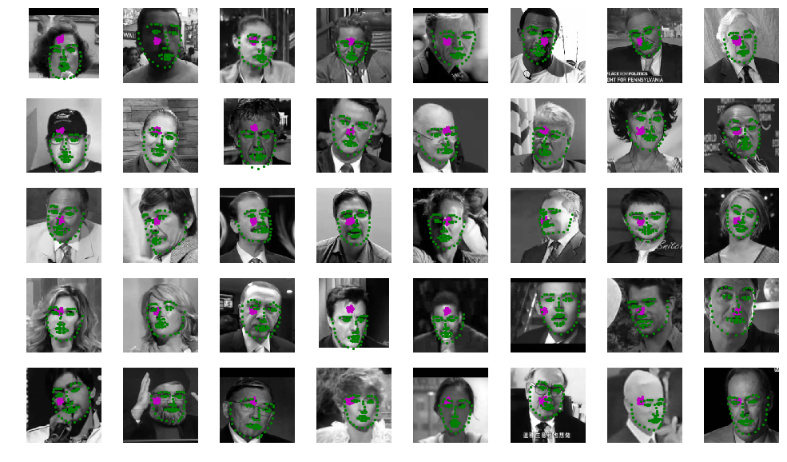
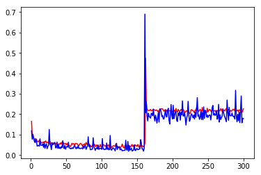
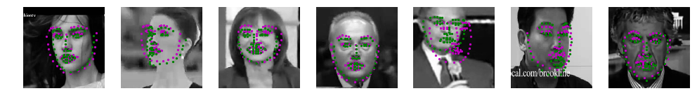
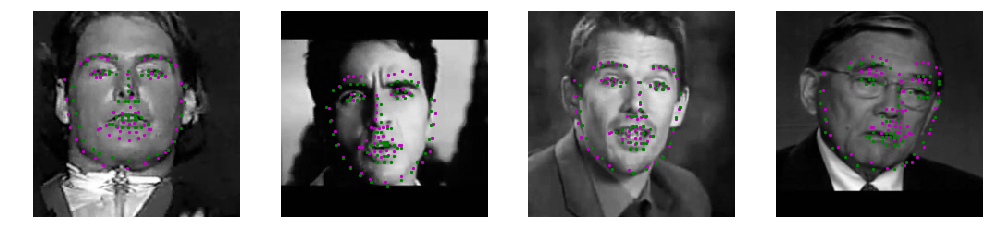

# Facial Landmarks Model Training and Outcomes

Victor Mawusi Ayi <ayivima@hotmail.com>

This notebook is dedicated to training a Convolutional Neural Network(CNN) to detect facial landmarks.

### Importing Relevant Libraries and Tools


```python
import matplotlib.pyplot as plt
import torch

from loaders import trainloader, testloader, train_dataset, test_dataset
from optimization import SmoothL1Adam, MSEAdam
from models import Net
from training import fit
from visualization import plotter
from workspace_utils import active_session

# watch for any changes in model.py, if it changes, re-load it automatically
%load_ext autoreload
%autoreload 2
```

### Loading Data

Data consists of:
+ Images: Separated into training and test folders
+ Keypoints CSV files: Two separate CSVs containing keypoints for training and testing respectively.


```python
# load the data if you need to; if you have already loaded the data, you may comment this cell out
# -- DO NOT CHANGE THIS CELL -- #
!mkdir /data
!wget -P /data/ https://s3.amazonaws.com/video.udacity-data.com/topher/2018/May/5aea1b91_train-test-data/train-test-data.zip
!unzip -n /data/train-test-data.zip -d /data
```

    mkdir: cannot create directory ‘/data’: File exists
    --2019-12-27 09:11:57--  https://s3.amazonaws.com/video.udacity-data.com/topher/2018/May/5aea1b91_train-test-data/train-test-data.zip
    Resolving s3.amazonaws.com (s3.amazonaws.com)... 52.216.105.77
    Connecting to s3.amazonaws.com (s3.amazonaws.com)|52.216.105.77|:443... connected.
    HTTP request sent, awaiting response... 200 OK
    Length: 338613624 (323M) [application/zip]
    Saving to: ‘/data/train-test-data.zip.5’
    
    train-test-data.zip 100%[===================>] 322.93M  66.8MB/s    in 4.8s    
    
    2019-12-27 09:12:02 (67.1 MB/s) - ‘/data/train-test-data.zip.5’ saved [338613624/338613624]
    
    Archive:  /data/train-test-data.zip


### Initializing Model

##### Initialise model


```python
device = torch.device("cuda" if torch.cuda.is_available() else "cpu")
```


```python
model = Net()
print(model)
```

    Net(
      (conv1): Conv2d(1, 8, kernel_size=(5, 5), stride=(1, 1), padding=(2, 2))
      (conv2): Conv2d(8, 16, kernel_size=(5, 5), stride=(1, 1), padding=(2, 2))
      (conv3): Conv2d(16, 32, kernel_size=(5, 5), stride=(2, 2))
      (conv4): Conv2d(32, 64, kernel_size=(3, 3), stride=(1, 1), padding=(1, 1))
      (conv5): Conv2d(64, 64, kernel_size=(3, 3), stride=(1, 1), padding=(1, 1))
      (dense1): Linear(in_features=2304, out_features=256, bias=True)
      (dense2): Linear(in_features=256, out_features=136, bias=True)
      (pool): MaxPool2d(kernel_size=2, stride=2, padding=0, dilation=1, ceil_mode=False)
      (drop): Dropout(p=0.3)
    )


##### Setting up train-, and test- loaders


```python
batch_size = 10

train_dataset, test_dataset = train_dataset(), test_dataset()

train_loader = trainloader(batch_size)
test_loader = testloader(batch_size)
test_loader_val = testloader(1)
```

##### Preview of keypoint predictions by untrained model (vrs actual keypoints)

Actual keypoints are in green, while predicted keypoints are in magenta.


```python
model.to(device)
plotter(model, test_loader, showactual=True)
```





### Training Model

##### Setting up parameters, criterion and optimizer for training


```python
n_epochs = 300
criterion, optimizer = MSEAdam(model.parameters())
```

##### Training


```python

```


```python
with active_session():
    train_losses, test_losses = fit(
        model,
        criterion,
        optimizer,
        train_loader,
        test_loader_val,
        n_epochs,
        dynamic_lr=False,
        model_save=True,
        save_name="bestmodela2.pt"
    )
```

    Started Training
    Epoch: 1/300, Batch Count: 347, Avg. Training Loss: 0.16460067961332778
    	 Average Validation Loss: 0.11854007095098495
    	 Estimated Completion Time: 2 hours, 48.05378246307373 minutes
    Epoch: 2/300, Batch Count: 347, Avg. Training Loss: 0.09568798552758412
    	 Average Validation Loss: 0.0775330439209938
    	 Estimated Completion Time: 2 hours, 45.36768865585327 minutes
    Epoch: 3/300, Batch Count: 347, Avg. Training Loss: 0.09495614207100113
    	 Average Validation Loss: 0.10172457247972488
    	 Estimated Completion Time: 2 hours, 1.110978126525879 minutes
    Epoch: 4/300, Batch Count: 347, Avg. Training Loss: 0.0799540237279378
    	 Average Validation Loss: 0.08200056850910187
    	 Estimated Completion Time: 2 hours, 59.89811325073242 minutes
    Epoch: 5/300, Batch Count: 347, Avg. Training Loss: 0.0803669795275851
    	 Average Validation Loss: 0.06764989346265793
    	 Estimated Completion Time: 2 hours, 33.57929468154907 minutes
    Epoch: 6/300, Batch Count: 347, Avg. Training Loss: 0.07101613027110738
    	 Average Validation Loss: 0.06097603589296341
    	 Estimated Completion Time: 2 hours, 15.881160736083984 minutes
    Epoch: 7/300, Batch Count: 347, Avg. Training Loss: 0.07113807951704054
    	 Average Validation Loss: 0.08012829720973969
    	 Estimated Completion Time: 2 hours, 44.010963439941406 minutes
    Epoch: 8/300, Batch Count: 347, Avg. Training Loss: 0.07642981970967236
    	 Average Validation Loss: 0.06341265887022018
    	 Estimated Completion Time: 2 hours, 23.762381553649902 minutes
    Epoch: 9/300, Batch Count: 347, Avg. Training Loss: 0.06414983320111672
    	 Average Validation Loss: 0.04347051680088043
    	 Estimated Completion Time: 2 hours, 25.078890323638916 minutes
    Epoch: 10/300, Batch Count: 347, Avg. Training Loss: 0.06774541127471312
    	 Average Validation Loss: 0.04705599322915077
    	 Estimated Completion Time: 2 hours, 58.62090349197388 minutes
    Epoch: 11/300, Batch Count: 347, Avg. Training Loss: 0.06462935712027447
    	 Average Validation Loss: 0.045671362429857254
    	 Estimated Completion Time: 2 hours, 51.56954002380371 minutes
    Epoch: 12/300, Batch Count: 347, Avg. Training Loss: 0.07260779538849417
    	 Average Validation Loss: 0.043677233159542084
    	 Estimated Completion Time: 2 hours, 35.688995361328125 minutes
    Epoch: 13/300, Batch Count: 347, Avg. Training Loss: 0.06804550729251818
    	 Average Validation Loss: 0.07925017923116684
    	 Estimated Completion Time: 2 hours, 42.16001081466675 minutes
    Epoch: 14/300, Batch Count: 347, Avg. Training Loss: 0.0652906927427744
    	 Average Validation Loss: 0.04811861738562584
    	 Estimated Completion Time: 2 hours, 45.80967092514038 minutes
    Epoch: 15/300, Batch Count: 347, Avg. Training Loss: 0.05910096133412305
    	 Average Validation Loss: 0.04775920882821083
    	 Estimated Completion Time: 2 hours, 19.110599756240845 minutes
    Epoch: 16/300, Batch Count: 347, Avg. Training Loss: 0.059047860568469814
    	 Average Validation Loss: 0.04759702458977699
    	 Estimated Completion Time: 2 hours, 7.833839416503906 minutes
    Epoch: 17/300, Batch Count: 347, Avg. Training Loss: 0.06361789439378107
    	 Average Validation Loss: 0.054771874099969864
    	 Estimated Completion Time: 2 hours, 34.612858295440674 minutes
    Epoch: 18/300, Batch Count: 347, Avg. Training Loss: 0.06092918307523133
    	 Average Validation Loss: 0.037645645439624786
    	 Estimated Completion Time: 2 hours, 14.376849174499512 minutes
    Epoch: 19/300, Batch Count: 347, Avg. Training Loss: 0.06541742573382188
    	 Average Validation Loss: 0.061899229884147644
    	 Estimated Completion Time: 2 hours, 52.08188557624817 minutes
    Epoch: 20/300, Batch Count: 347, Avg. Training Loss: 0.06427611212275643
    	 Average Validation Loss: 0.03275427594780922
    	 Estimated Completion Time: 2 hours, 47.220754623413086 minutes
    Epoch: 21/300, Batch Count: 347, Avg. Training Loss: 0.06938879915462104
    	 Average Validation Loss: 0.04815924912691116
    	 Estimated Completion Time: 2 hours, 19.33834147453308 minutes
    Epoch: 22/300, Batch Count: 347, Avg. Training Loss: 0.061089052161153526
    	 Average Validation Loss: 0.05469055473804474
    	 Estimated Completion Time: 2 hours, 47.51492691040039 minutes
    Epoch: 23/300, Batch Count: 347, Avg. Training Loss: 0.06083263068725637
    	 Average Validation Loss: 0.03106646239757538
    	 Estimated Completion Time: 2 hours, 21.074068069458008 minutes
    Epoch: 24/300, Batch Count: 347, Avg. Training Loss: 0.06318914561776676
    	 Average Validation Loss: 0.04227098450064659
    	 Estimated Completion Time: 2 hours, 44.11159801483154 minutes
    Epoch: 25/300, Batch Count: 347, Avg. Training Loss: 0.056872736539165636
    	 Average Validation Loss: 0.04694002866744995
    	 Estimated Completion Time: 2 hours, 36.307010650634766 minutes
    Epoch: 26/300, Batch Count: 347, Avg. Training Loss: 0.06133596355401473
    	 Average Validation Loss: 0.12488433718681335
    	 Estimated Completion Time: 2 hours, 53.98392915725708 minutes
    Epoch: 27/300, Batch Count: 347, Avg. Training Loss: 0.06718063471511393
    	 Average Validation Loss: 0.05235755443572998
    	 Estimated Completion Time: 2 hours, 25.112666130065918 minutes
    Epoch: 28/300, Batch Count: 347, Avg. Training Loss: 0.05087218121209475
    	 Average Validation Loss: 0.04780324175953865
    	 Estimated Completion Time: 2 hours, 5.460365295410156 minutes
    Epoch: 29/300, Batch Count: 347, Avg. Training Loss: 0.060282011728422444
    	 Average Validation Loss: 0.026411117985844612
    	 Estimated Completion Time: 2 hours, 7.989262342453003 minutes
    Epoch: 30/300, Batch Count: 347, Avg. Training Loss: 0.05853997696706387
    	 Average Validation Loss: 0.059847958385944366
    	 Estimated Completion Time: 2 hours, 8.252592086791992 minutes
    Epoch: 31/300, Batch Count: 347, Avg. Training Loss: 0.05965696173781792
    	 Average Validation Loss: 0.05067545175552368
    	 Estimated Completion Time: 2 hours, 30.910101413726807 minutes
    Epoch: 32/300, Batch Count: 347, Avg. Training Loss: 0.05448959748494178
    	 Average Validation Loss: 0.05264604091644287
    	 Estimated Completion Time: 2 hours, 44.343135833740234 minutes
    Epoch: 33/300, Batch Count: 347, Avg. Training Loss: 0.054640641873460856
    	 Average Validation Loss: 0.06030767783522606
    	 Estimated Completion Time: 2 hours, 52.583354473114014 minutes
    Epoch: 34/300, Batch Count: 347, Avg. Training Loss: 0.05715073245209816
    	 Average Validation Loss: 0.06148812547326088
    	 Estimated Completion Time: 2 hours, 41.199779987335205 minutes
    Epoch: 35/300, Batch Count: 347, Avg. Training Loss: 0.05295460536453325
    	 Average Validation Loss: 0.03505953028798103
    	 Estimated Completion Time: 2 hours, 24.913493394851685 minutes
    Epoch: 36/300, Batch Count: 347, Avg. Training Loss: 0.0574087330813839
    	 Average Validation Loss: 0.0359351672232151
    	 Estimated Completion Time: 2 hours, 21.31365394592285 minutes
    Epoch: 37/300, Batch Count: 347, Avg. Training Loss: 0.05576302529573011
    	 Average Validation Loss: 0.06325758993625641
    	 Estimated Completion Time: 2 hours, 4.509507417678833 minutes
    Epoch: 38/300, Batch Count: 347, Avg. Training Loss: 0.05075843724548301
    	 Average Validation Loss: 0.032619278877973557
    	 Estimated Completion Time: 2 hours, 48.334184646606445 minutes
    Epoch: 39/300, Batch Count: 347, Avg. Training Loss: 0.05306494662468389
    	 Average Validation Loss: 0.05086856335401535
    	 Estimated Completion Time: 2 hours, 29.045021295547485 minutes
    Epoch: 40/300, Batch Count: 347, Avg. Training Loss: 0.055164134913588465
    	 Average Validation Loss: 0.03224986791610718
    	 Estimated Completion Time: 2 hours, 38.84608745574951 minutes
    Epoch: 41/300, Batch Count: 347, Avg. Training Loss: 0.051818058240933274
    	 Average Validation Loss: 0.037849511951208115
    	 Estimated Completion Time: 2 hours, 52.6841721534729 minutes
    Epoch: 42/300, Batch Count: 347, Avg. Training Loss: 0.059644057812646936
    	 Average Validation Loss: 0.03153659775853157
    	 Estimated Completion Time: 2 hours, 48.79426574707031 minutes
    Epoch: 43/300, Batch Count: 347, Avg. Training Loss: 0.053694991282152514
    	 Average Validation Loss: 0.04088842123746872
    	 Estimated Completion Time: 2 hours, 3.8911495208740234 minutes
    Epoch: 44/300, Batch Count: 347, Avg. Training Loss: 0.06288750483104234
    	 Average Validation Loss: 0.03574203699827194
    	 Estimated Completion Time: 2 hours, 43.3394775390625 minutes
    Epoch: 45/300, Batch Count: 347, Avg. Training Loss: 0.048483755380473496
    	 Average Validation Loss: 0.0699400007724762
    	 Estimated Completion Time: 2 hours, 21.649203300476074 minutes
    Epoch: 46/300, Batch Count: 347, Avg. Training Loss: 0.06141495960160703
    	 Average Validation Loss: 0.04003630205988884
    	 Estimated Completion Time: 2 hours, 43.69936752319336 minutes
    Epoch: 47/300, Batch Count: 347, Avg. Training Loss: 0.052806571131352044
    	 Average Validation Loss: 0.031415633857250214
    	 Estimated Completion Time: 2 hours, 46.517820596694946 minutes
    Epoch: 48/300, Batch Count: 347, Avg. Training Loss: 0.0555356859634778
    	 Average Validation Loss: 0.04695151373744011
    	 Estimated Completion Time: 2 hours, 1.4636449813842773 minutes
    Epoch: 49/300, Batch Count: 347, Avg. Training Loss: 0.057106958487492476
    	 Average Validation Loss: 0.028482092544436455
    	 Estimated Completion Time: 2 hours, 5.231135606765747 minutes
    Epoch: 50/300, Batch Count: 347, Avg. Training Loss: 0.05025907453439421
    	 Average Validation Loss: 0.04004291817545891
    	 Estimated Completion Time: 2 hours, 27.100794315338135 minutes
    Epoch: 51/300, Batch Count: 347, Avg. Training Loss: 0.055774560989946216
    	 Average Validation Loss: 0.04132480174303055
    	 Estimated Completion Time: 2 hours, 0.899348258972168 minutes
    Epoch: 52/300, Batch Count: 347, Avg. Training Loss: 0.04785711661797092
    	 Average Validation Loss: 0.03836200758814812
    	 Estimated Completion Time: 2 hours, 42.62440490722656 minutes
    Epoch: 53/300, Batch Count: 347, Avg. Training Loss: 0.05092722379873568
    	 Average Validation Loss: 0.062461793422698975
    	 Estimated Completion Time: 2 hours, 26.214343547821045 minutes
    Epoch: 54/300, Batch Count: 347, Avg. Training Loss: 0.04582297974279532
    	 Average Validation Loss: 0.03584163263440132
    	 Estimated Completion Time: 2 hours, 16.674526691436768 minutes
    Epoch: 55/300, Batch Count: 347, Avg. Training Loss: 0.04476249165918882
    	 Average Validation Loss: 0.0345679447054863
    	 Estimated Completion Time: 2 hours, 30.273282527923584 minutes
    Epoch: 56/300, Batch Count: 347, Avg. Training Loss: 0.040967816755347365
    	 Average Validation Loss: 0.030302129685878754
    	 Estimated Completion Time: 1 hours, 59.15557098388672 minutes
    Epoch: 57/300, Batch Count: 347, Avg. Training Loss: 0.0496395964642466
    	 Average Validation Loss: 0.03406890109181404
    	 Estimated Completion Time: 1 hours, 50.11685800552368 minutes
    Epoch: 58/300, Batch Count: 347, Avg. Training Loss: 0.057545012560933397
    	 Average Validation Loss: 0.031193435192108154
    	 Estimated Completion Time: 1 hours, 5.634616851806641 minutes
    Epoch: 59/300, Batch Count: 347, Avg. Training Loss: 0.052238126728222076
    	 Average Validation Loss: 0.0356028750538826
    	 Estimated Completion Time: 1 hours, 26.643205642700195 minutes
    Epoch: 60/300, Batch Count: 347, Avg. Training Loss: 0.05556723603747935
    	 Average Validation Loss: 0.032032039016485214
    	 Estimated Completion Time: 1 hours, 14.63338851928711 minutes
    Epoch: 61/300, Batch Count: 347, Avg. Training Loss: 0.05539745854358766
    	 Average Validation Loss: 0.04289139062166214
    	 Estimated Completion Time: 1 hours, 44.262948989868164 minutes
    Epoch: 62/300, Batch Count: 347, Avg. Training Loss: 0.04714069380196783
    	 Average Validation Loss: 0.0467517226934433
    	 Estimated Completion Time: 1 hours, 56.894176959991455 minutes
    Epoch: 63/300, Batch Count: 347, Avg. Training Loss: 0.055769872279993395
    	 Average Validation Loss: 0.036647580564022064
    	 Estimated Completion Time: 1 hours, 1.322831153869629 minutes
    Epoch: 64/300, Batch Count: 347, Avg. Training Loss: 0.05723034737293504
    	 Average Validation Loss: 0.030629636719822884
    	 Estimated Completion Time: 1 hours, 4.669802665710449 minutes
    Epoch: 65/300, Batch Count: 347, Avg. Training Loss: 0.05485518768923599
    	 Average Validation Loss: 0.038878969848155975
    	 Estimated Completion Time: 1 hours, 27.847509384155273 minutes
    Epoch: 66/300, Batch Count: 347, Avg. Training Loss: 0.05426742488878004
    	 Average Validation Loss: 0.03245832026004791
    	 Estimated Completion Time: 1 hours, 19.83448076248169 minutes
    Epoch: 67/300, Batch Count: 347, Avg. Training Loss: 0.043466625802261856
    	 Average Validation Loss: 0.044869113713502884
    	 Estimated Completion Time: 1 hours, 28.80465793609619 minutes
    Epoch: 68/300, Batch Count: 347, Avg. Training Loss: 0.047121860513662225
    	 Average Validation Loss: 0.03199395537376404
    	 Estimated Completion Time: 1 hours, 20.080583572387695 minutes
    Epoch: 69/300, Batch Count: 347, Avg. Training Loss: 0.05340352243816303
    	 Average Validation Loss: 0.0331655889749527
    	 Estimated Completion Time: 1 hours, 3.8806164264678955 minutes
    Epoch: 70/300, Batch Count: 347, Avg. Training Loss: 0.05716952424421262
    	 Average Validation Loss: 0.031111154705286026
    	 Estimated Completion Time: 1 hours, 45.769450664520264 minutes
    Epoch: 71/300, Batch Count: 347, Avg. Training Loss: 0.054859200986343774
    	 Average Validation Loss: 0.03374304994940758
    	 Estimated Completion Time: 1 hours, 9.280107736587524 minutes
    Epoch: 72/300, Batch Count: 347, Avg. Training Loss: 0.051234548718209566
    	 Average Validation Loss: 0.03409427031874657
    	 Estimated Completion Time: 1 hours, 22.713892936706543 minutes
    Epoch: 73/300, Batch Count: 347, Avg. Training Loss: 0.04197099812930015
    	 Average Validation Loss: 0.030082248151302338
    	 Estimated Completion Time: 1 hours, 38.734567642211914 minutes
    Epoch: 74/300, Batch Count: 347, Avg. Training Loss: 0.051507083924557016
    	 Average Validation Loss: 0.044082190841436386
    	 Estimated Completion Time: 1 hours, 7.207761764526367 minutes
    Epoch: 75/300, Batch Count: 347, Avg. Training Loss: 0.05096153254145676
    	 Average Validation Loss: 0.03293357416987419
    	 Estimated Completion Time: 1 hours, 15.516003370285034 minutes
    Epoch: 76/300, Batch Count: 347, Avg. Training Loss: 0.055358482723363196
    	 Average Validation Loss: 0.04724568873643875
    	 Estimated Completion Time: 1 hours, 28.504425048828125 minutes
    Epoch: 77/300, Batch Count: 347, Avg. Training Loss: 0.045688252042581784
    	 Average Validation Loss: 0.045143287628889084
    	 Estimated Completion Time: 1 hours, 27.688754558563232 minutes
    Epoch: 78/300, Batch Count: 347, Avg. Training Loss: 0.061617084365520595
    	 Average Validation Loss: 0.027684075757861137
    	 Estimated Completion Time: 1 hours, 41.901710987091064 minutes
    Epoch: 79/300, Batch Count: 347, Avg. Training Loss: 0.05392055690653558
    	 Average Validation Loss: 0.03717784956097603
    	 Estimated Completion Time: 1 hours, 6.962010383605957 minutes
    Epoch: 80/300, Batch Count: 347, Avg. Training Loss: 0.053784198396079654
    	 Average Validation Loss: 0.04389079287648201
    	 Estimated Completion Time: 1 hours, 42.367286682128906 minutes
    Epoch: 81/300, Batch Count: 347, Avg. Training Loss: 0.05130311513926179
    	 Average Validation Loss: 0.0892939642071724
    	 Estimated Completion Time: 1 hours, 10.48595666885376 minutes
    Epoch: 82/300, Batch Count: 347, Avg. Training Loss: 0.05574906156572811
    	 Average Validation Loss: 0.04143805429339409
    	 Estimated Completion Time: 1 hours, 21.674583911895752 minutes
    Epoch: 83/300, Batch Count: 347, Avg. Training Loss: 0.04191426162793159
    	 Average Validation Loss: 0.04997403547167778
    	 Estimated Completion Time: 1 hours, 10.538385391235352 minutes
    Epoch: 84/300, Batch Count: 347, Avg. Training Loss: 0.04803527434563173
    	 Average Validation Loss: 0.026430727913975716
    	 Estimated Completion Time: 1 hours, 0.6210823059082031 minutes
    Epoch: 85/300, Batch Count: 347, Avg. Training Loss: 0.040405691174591654
    	 Average Validation Loss: 0.02581857144832611
    	 Estimated Completion Time: 1 hours, 48.04071068763733 minutes
    Epoch: 86/300, Batch Count: 347, Avg. Training Loss: 0.04087405651807785
    	 Average Validation Loss: 0.02830544114112854
    	 Estimated Completion Time: 1 hours, 57.37513542175293 minutes
    Epoch: 87/300, Batch Count: 347, Avg. Training Loss: 0.04819333159850551
    	 Average Validation Loss: 0.028941728174686432
    	 Estimated Completion Time: 1 hours, 25.441195964813232 minutes
    Epoch: 88/300, Batch Count: 347, Avg. Training Loss: 0.051528246998142783
    	 Average Validation Loss: 0.08463779091835022
    	 Estimated Completion Time: 1 hours, 48.66191387176514 minutes
    Epoch: 89/300, Batch Count: 347, Avg. Training Loss: 0.04576727842928181
    	 Average Validation Loss: 0.0401899553835392
    	 Estimated Completion Time: 1 hours, 54.73224711418152 minutes
    Epoch: 90/300, Batch Count: 347, Avg. Training Loss: 0.052732759375415036
    	 Average Validation Loss: 0.03218906745314598
    	 Estimated Completion Time: 1 hours, 42.058539390563965 minutes
    Epoch: 91/300, Batch Count: 347, Avg. Training Loss: 0.04182835159452917
    	 Average Validation Loss: 0.022846387699246407
    	 Estimated Completion Time: 1 hours, 52.377814054489136 minutes
    Epoch: 92/300, Batch Count: 347, Avg. Training Loss: 0.04153596700010794
    	 Average Validation Loss: 0.03275344893336296
    	 Estimated Completion Time: 1 hours, 24.174659729003906 minutes
    Epoch: 93/300, Batch Count: 347, Avg. Training Loss: 0.04980931272166607
    	 Average Validation Loss: 0.0349571518599987
    	 Estimated Completion Time: 1 hours, 5.428826808929443 minutes
    Epoch: 94/300, Batch Count: 347, Avg. Training Loss: 0.040557725116159626
    	 Average Validation Loss: 0.029341502115130424
    	 Estimated Completion Time: 1 hours, 9.786789894104004 minutes
    Epoch: 95/300, Batch Count: 347, Avg. Training Loss: 0.04765216821283961
    	 Average Validation Loss: 0.04881075397133827
    	 Estimated Completion Time: 1 hours, 43.61236929893494 minutes
    Epoch: 96/300, Batch Count: 347, Avg. Training Loss: 0.03989862666199633
    	 Average Validation Loss: 0.027580801397562027
    	 Estimated Completion Time: 1 hours, 10.337568283081055 minutes
    Epoch: 97/300, Batch Count: 347, Avg. Training Loss: 0.03882479372700027
    	 Average Validation Loss: 0.031303856521844864
    	 Estimated Completion Time: 1 hours, 38.46569466590881 minutes
    Epoch: 98/300, Batch Count: 347, Avg. Training Loss: 0.05176100092443506
    	 Average Validation Loss: 0.03292665258049965
    	 Estimated Completion Time: 1 hours, 19.56400203704834 minutes
    Epoch: 99/300, Batch Count: 347, Avg. Training Loss: 0.04192372483955508
    	 Average Validation Loss: 0.03228549286723137
    	 Estimated Completion Time: 1 hours, 37.87150239944458 minutes
    Epoch: 100/300, Batch Count: 347, Avg. Training Loss: 0.03880572165510153
    	 Average Validation Loss: 0.027721434831619263
    	 Estimated Completion Time: 1 hours, 21.72186851501465 minutes
    Epoch: 101/300, Batch Count: 347, Avg. Training Loss: 0.04468022334129048
    	 Average Validation Loss: 0.0803912803530693
    	 Estimated Completion Time: 1 hours, 50.5124306678772 minutes
    Epoch: 102/300, Batch Count: 347, Avg. Training Loss: 0.050289607732972766
    	 Average Validation Loss: 0.029667304828763008
    	 Estimated Completion Time: 1 hours, 0.27722883224487305 minutes
    Epoch: 103/300, Batch Count: 347, Avg. Training Loss: 0.05044080872593249
    	 Average Validation Loss: 0.02978828176856041
    	 Estimated Completion Time: 1 hours, 12.425247192382812 minutes
    Epoch: 104/300, Batch Count: 347, Avg. Training Loss: 0.045401125220361806
    	 Average Validation Loss: 0.025922678411006927
    	 Estimated Completion Time: 1 hours, 15.249144554138184 minutes
    Epoch: 105/300, Batch Count: 347, Avg. Training Loss: 0.04259186064132009
    	 Average Validation Loss: 0.028655514121055603
    	 Estimated Completion Time: 1 hours, 31.628140211105347 minutes
    Epoch: 106/300, Batch Count: 347, Avg. Training Loss: 0.0469976627785895
    	 Average Validation Loss: 0.028117258101701736
    	 Estimated Completion Time: 1 hours, 45.13299083709717 minutes
    Epoch: 107/300, Batch Count: 347, Avg. Training Loss: 0.04637015312480652
    	 Average Validation Loss: 0.05874829739332199
    	 Estimated Completion Time: 1 hours, 48.190353870391846 minutes
    Epoch: 108/300, Batch Count: 347, Avg. Training Loss: 0.04143910736425294
    	 Average Validation Loss: 0.027719762176275253
    	 Estimated Completion Time: 1 hours, 40.91111755371094 minutes
    Epoch: 109/300, Batch Count: 347, Avg. Training Loss: 0.050424829310595304
    	 Average Validation Loss: 0.03444299101829529
    	 Estimated Completion Time: 1 hours, 13.900240421295166 minutes
    Epoch: 110/300, Batch Count: 347, Avg. Training Loss: 0.047695869311518556
    	 Average Validation Loss: 0.025367362424731255
    	 Estimated Completion Time: 1 hours, 38.401594161987305 minutes
    Epoch: 111/300, Batch Count: 347, Avg. Training Loss: 0.037107427271689565
    	 Average Validation Loss: 0.026937246322631836
    	 Estimated Completion Time: 1 hours, 45.803250789642334 minutes
    Epoch: 112/300, Batch Count: 347, Avg. Training Loss: 0.034523157110325026
    	 Average Validation Loss: 0.09581982344388962
    	 Estimated Completion Time: 1 hours, 19.345847129821777 minutes
    Epoch: 113/300, Batch Count: 347, Avg. Training Loss: 0.04095213180703114
    	 Average Validation Loss: 0.026090677827596664
    	 Estimated Completion Time: 1 hours, 50.862273931503296 minutes
    Epoch: 114/300, Batch Count: 347, Avg. Training Loss: 0.03625963217919687
    	 Average Validation Loss: 0.024051839485764503
    	 Estimated Completion Time: 1 hours, 40.43512201309204 minutes
    Epoch: 115/300, Batch Count: 347, Avg. Training Loss: 0.04264209938828729
    	 Average Validation Loss: 0.029651040211319923
    	 Estimated Completion Time: 1 hours, 26.753543615341187 minutes
    Epoch: 116/300, Batch Count: 347, Avg. Training Loss: 0.04392536449372253
    	 Average Validation Loss: 0.03595137968659401
    	 Estimated Completion Time: 1 hours, 13.024126052856445 minutes
    Epoch: 117/300, Batch Count: 347, Avg. Training Loss: 0.04649815806093752
    	 Average Validation Loss: 0.030434126034379005
    	 Estimated Completion Time: 1 hours, 22.578272581100464 minutes
    Epoch: 118/300, Batch Count: 347, Avg. Training Loss: 0.04430615471445174
    	 Average Validation Loss: 0.029254386201500893
    	 Estimated Completion Time: 1 hours, 10.3797025680542 minutes
    Epoch: 119/300, Batch Count: 347, Avg. Training Loss: 0.04244061342577426
    	 Average Validation Loss: 0.020009834319353104
    	 Estimated Completion Time: 1 hours, 57.6638081073761 minutes
    Epoch: 120/300, Batch Count: 347, Avg. Training Loss: 0.05487135369115931
    	 Average Validation Loss: 0.03665179759263992
    	 Estimated Completion Time: 1 hours, 18.940515518188477 minutes
    Epoch: 121/300, Batch Count: 347, Avg. Training Loss: 0.04440154517955155
    	 Average Validation Loss: 0.05719630420207977
    	 Estimated Completion Time: 1 hours, 35.95398211479187 minutes
    Epoch: 122/300, Batch Count: 347, Avg. Training Loss: 0.040026259664929224
    	 Average Validation Loss: 0.027298536151647568
    	 Estimated Completion Time: 1 hours, 38.81502294540405 minutes
    Epoch: 123/300, Batch Count: 347, Avg. Training Loss: 0.04147552216817391
    	 Average Validation Loss: 0.04077522084116936
    	 Estimated Completion Time: 1 hours, 55.84708571434021 minutes
    Epoch: 124/300, Batch Count: 347, Avg. Training Loss: 0.038044609687685624
    	 Average Validation Loss: 0.03555706888437271
    	 Estimated Completion Time: 1 hours, 56.03137969970703 minutes
    Epoch: 125/300, Batch Count: 347, Avg. Training Loss: 0.041502207697446995
    	 Average Validation Loss: 0.03895402327179909
    	 Estimated Completion Time: 1 hours, 26.403671503067017 minutes
    Epoch: 126/300, Batch Count: 347, Avg. Training Loss: 0.036161730562468256
    	 Average Validation Loss: 0.025473682209849358
    	 Estimated Completion Time: 1 hours, 1.0643949508666992 minutes
    Epoch: 127/300, Batch Count: 347, Avg. Training Loss: 0.03845669986728461
    	 Average Validation Loss: 0.03144318610429764
    	 Estimated Completion Time: 1 hours, 29.763736724853516 minutes
    Epoch: 128/300, Batch Count: 347, Avg. Training Loss: 0.04255868575028453
    	 Average Validation Loss: 0.026690766215324402
    	 Estimated Completion Time: 1 hours, 33.68833923339844 minutes
    Epoch: 129/300, Batch Count: 347, Avg. Training Loss: 0.05385572603374977
    	 Average Validation Loss: 0.020560353994369507
    	 Estimated Completion Time: 1 hours, 34.92918920516968 minutes
    Epoch: 130/300, Batch Count: 347, Avg. Training Loss: 0.04327282783513626
    	 Average Validation Loss: 0.022335447371006012
    	 Estimated Completion Time: 1 hours, 57.254953384399414 minutes
    Epoch: 131/300, Batch Count: 347, Avg. Training Loss: 0.035288729688812914
    	 Average Validation Loss: 0.022282592952251434
    	 Estimated Completion Time: 1 hours, 2.7071893215179443 minutes
    Epoch: 132/300, Batch Count: 347, Avg. Training Loss: 0.03470982163231981
    	 Average Validation Loss: 0.023409230634570122
    	 Estimated Completion Time: 1 hours, 36.477407455444336 minutes
    Epoch: 133/300, Batch Count: 347, Avg. Training Loss: 0.046110991130902376
    	 Average Validation Loss: 0.022631723433732986
    	 Estimated Completion Time: 1 hours, 42.65584850311279 minutes
    Epoch: 134/300, Batch Count: 347, Avg. Training Loss: 0.04158513238841415
    	 Average Validation Loss: 0.0724063366651535
    	 Estimated Completion Time: 1 hours, 54.068007469177246 minutes
    Epoch: 135/300, Batch Count: 347, Avg. Training Loss: 0.04395305076801897
    	 Average Validation Loss: 0.02775811403989792
    	 Estimated Completion Time: 1 hours, 42.22781538963318 minutes
    Epoch: 136/300, Batch Count: 347, Avg. Training Loss: 0.04323641207305344
    	 Average Validation Loss: 0.023756813257932663
    	 Estimated Completion Time: 1 hours, 32.82332706451416 minutes
    Epoch: 137/300, Batch Count: 347, Avg. Training Loss: 0.04773372425147539
    	 Average Validation Loss: 0.06648845225572586
    	 Estimated Completion Time: 1 hours, 47.25058364868164 minutes
    Epoch: 138/300, Batch Count: 347, Avg. Training Loss: 0.047047508480590944
    	 Average Validation Loss: 0.01804998517036438
    	 Estimated Completion Time: 1 hours, 11.748314380645752 minutes
    Epoch: 139/300, Batch Count: 347, Avg. Training Loss: 0.04134464237345141
    	 Average Validation Loss: 0.046586617827415466
    	 Estimated Completion Time: 1 hours, 43.886298179626465 minutes
    Epoch: 140/300, Batch Count: 347, Avg. Training Loss: 0.04190449346855326
    	 Average Validation Loss: 0.023682570084929466
    	 Estimated Completion Time: 1 hours, 27.427825927734375 minutes
    Epoch: 141/300, Batch Count: 347, Avg. Training Loss: 0.03911491127024466
    	 Average Validation Loss: 0.02854059636592865
    	 Estimated Completion Time: 1 hours, 34.07031726837158 minutes
    Epoch: 142/300, Batch Count: 347, Avg. Training Loss: 0.04842871452496529
    	 Average Validation Loss: 0.033388301730155945
    	 Estimated Completion Time: 1 hours, 24.069132328033447 minutes
    Epoch: 143/300, Batch Count: 347, Avg. Training Loss: 0.05160662427984758
    	 Average Validation Loss: 0.019252413883805275
    	 Estimated Completion Time: 1 hours, 37.88140797615051 minutes
    Epoch: 144/300, Batch Count: 347, Avg. Training Loss: 0.042454685025475385
    	 Average Validation Loss: 0.02270752564072609
    	 Estimated Completion Time: 1 hours, 32.81114101409912 minutes
    Epoch: 145/300, Batch Count: 347, Avg. Training Loss: 0.04707545451068397
    	 Average Validation Loss: 0.02353357896208763
    	 Estimated Completion Time: 1 hours, 13.5648512840271 minutes
    Epoch: 146/300, Batch Count: 347, Avg. Training Loss: 0.03542160681349572
    	 Average Validation Loss: 0.04952460154891014
    	 Estimated Completion Time: 1 hours, 32.762428760528564 minutes
    Epoch: 147/300, Batch Count: 347, Avg. Training Loss: 0.05007568277923192
    	 Average Validation Loss: 0.024384187534451485
    	 Estimated Completion Time: 1 hours, 45.589040994644165 minutes
    Epoch: 148/300, Batch Count: 347, Avg. Training Loss: 0.04553682059156963
    	 Average Validation Loss: 0.021387087181210518
    	 Estimated Completion Time: 1 hours, 13.281906127929688 minutes
    Epoch: 149/300, Batch Count: 347, Avg. Training Loss: 0.046474319039937914
    	 Average Validation Loss: 0.030184296891093254
    	 Estimated Completion Time: 1 hours, 56.16242599487305 minutes
    Epoch: 150/300, Batch Count: 347, Avg. Training Loss: 0.04214813967130713
    	 Average Validation Loss: 0.03159582242369652
    	 Estimated Completion Time: 1 hours, 2.4898624420166016 minutes
    Epoch: 151/300, Batch Count: 347, Avg. Training Loss: 0.05167243098544885
    	 Average Validation Loss: 0.025670243427157402
    	 Estimated Completion Time: 1 hours, 54.607428789138794 minutes
    Epoch: 152/300, Batch Count: 347, Avg. Training Loss: 0.043927320679086085
    	 Average Validation Loss: 0.027050668373703957
    	 Estimated Completion Time: 1 hours, 47.885539054870605 minutes
    Epoch: 153/300, Batch Count: 347, Avg. Training Loss: 0.03643444048707784
    	 Average Validation Loss: 0.03019195795059204
    	 Estimated Completion Time: 1 hours, 12.713652849197388 minutes
    Epoch: 154/300, Batch Count: 347, Avg. Training Loss: 0.04683206036085698
    	 Average Validation Loss: 0.029486292973160744
    	 Estimated Completion Time: 1 hours, 24.052102088928223 minutes
    Epoch: 155/300, Batch Count: 347, Avg. Training Loss: 0.0406883011131899
    	 Average Validation Loss: 0.07546702027320862
    	 Estimated Completion Time: 1 hours, 42.1271550655365 minutes
    Epoch: 156/300, Batch Count: 347, Avg. Training Loss: 0.048934160487495514
    	 Average Validation Loss: 0.05855710431933403
    	 Estimated Completion Time: 1 hours, 30.598777770996094 minutes
    Epoch: 157/300, Batch Count: 347, Avg. Training Loss: 0.04351702344305921
    	 Average Validation Loss: 0.029696397483348846
    	 Estimated Completion Time: 1 hours, 21.32816505432129 minutes
    Epoch: 158/300, Batch Count: 347, Avg. Training Loss: 0.043829235860202945
    	 Average Validation Loss: 0.02955697476863861
    	 Estimated Completion Time: 1 hours, 57.84919357299805 minutes
    Epoch: 159/300, Batch Count: 347, Avg. Training Loss: 0.040740841897660786
    	 Average Validation Loss: 0.018971558660268784
    	 Estimated Completion Time: 1 hours, 35.04644536972046 minutes
    Epoch: 160/300, Batch Count: 347, Avg. Training Loss: 0.04129830896532329
    	 Average Validation Loss: 0.032331544905900955
    	 Estimated Completion Time: 1 hours, 45.602779388427734 minutes
    Epoch: 161/300, Batch Count: 347, Avg. Training Loss: 0.05827891225161659
    	 Average Validation Loss: 0.6901327967643738
    	 Estimated Completion Time: 1 hours, 36.98160696029663 minutes
    Epoch: 162/300, Batch Count: 347, Avg. Training Loss: 0.47380913240078204
    	 Average Validation Loss: 0.20633506774902344
    	 Estimated Completion Time: 1 hours, 3.794297218322754 minutes
    Epoch: 163/300, Batch Count: 347, Avg. Training Loss: 0.25293507749048366
    	 Average Validation Loss: 0.26074570417404175
    	 Estimated Completion Time: 1 hours, 55.89017343521118 minutes
    Epoch: 164/300, Batch Count: 347, Avg. Training Loss: 0.22337949179349098
    	 Average Validation Loss: 0.19179849326610565
    	 Estimated Completion Time: 1 hours, 32.35603904724121 minutes
    Epoch: 165/300, Batch Count: 347, Avg. Training Loss: 0.221166259638686
    	 Average Validation Loss: 0.16693195700645447
    	 Estimated Completion Time: 1 hours, 10.409460067749023 minutes
    Epoch: 166/300, Batch Count: 347, Avg. Training Loss: 0.21665445406000622
    	 Average Validation Loss: 0.20467209815979004
    	 Estimated Completion Time: 1 hours, 24.175123691558838 minutes
    Epoch: 167/300, Batch Count: 347, Avg. Training Loss: 0.2172264255991243
    	 Average Validation Loss: 0.18983080983161926
    	 Estimated Completion Time: 1 hours, 5.809579849243164 minutes
    Epoch: 168/300, Batch Count: 347, Avg. Training Loss: 0.2202824143322469
    	 Average Validation Loss: 0.18512561917304993
    	 Estimated Completion Time: 1 hours, 6.6210479736328125 minutes
    Epoch: 169/300, Batch Count: 347, Avg. Training Loss: 0.22286180299451783
    	 Average Validation Loss: 0.18052171170711517
    	 Estimated Completion Time: 1 hours, 4.259326696395874 minutes
    Epoch: 170/300, Batch Count: 347, Avg. Training Loss: 0.2153676636624405
    	 Average Validation Loss: 0.20440852642059326
    	 Estimated Completion Time: 1 hours, 38.568644523620605 minutes
    Epoch: 171/300, Batch Count: 347, Avg. Training Loss: 0.21689091126839777
    	 Average Validation Loss: 0.20405709743499756
    	 Estimated Completion Time: 1 hours, 18.354178190231323 minutes
    Epoch: 172/300, Batch Count: 347, Avg. Training Loss: 0.2211194489934946
    	 Average Validation Loss: 0.19219739735126495
    	 Estimated Completion Time: 1 hours, 3.445526123046875 minutes
    Epoch: 173/300, Batch Count: 347, Avg. Training Loss: 0.22238096302799257
    	 Average Validation Loss: 0.2249480038881302
    	 Estimated Completion Time: 1 hours, 4.802654027938843 minutes
    Epoch: 174/300, Batch Count: 347, Avg. Training Loss: 0.22153200853283192
    	 Average Validation Loss: 0.19157028198242188
    	 Estimated Completion Time: 1 hours, 8.824629306793213 minutes
    Epoch: 175/300, Batch Count: 347, Avg. Training Loss: 0.22024201575978
    	 Average Validation Loss: 0.1666618138551712
    	 Estimated Completion Time: 1 hours, 55.45705437660217 minutes
    Epoch: 176/300, Batch Count: 347, Avg. Training Loss: 0.2171797345282365
    	 Average Validation Loss: 0.19538961350917816
    	 Estimated Completion Time: 1 hours, 42.80936050415039 minutes
    Epoch: 177/300, Batch Count: 347, Avg. Training Loss: 0.2201418216401974
    	 Average Validation Loss: 0.17984983325004578
    	 Estimated Completion Time: 1 hours, 4.110202074050903 minutes
    Epoch: 178/300, Batch Count: 347, Avg. Training Loss: 0.21980302452353992
    	 Average Validation Loss: 0.1561669558286667
    	 Estimated Completion Time: 1 hours, 52.98111867904663 minutes
    Epoch: 179/300, Batch Count: 347, Avg. Training Loss: 0.21357181460008842
    	 Average Validation Loss: 0.1797015517950058
    	 Estimated Completion Time: 1 hours, 13.540399074554443 minutes
    Epoch: 180/300, Batch Count: 347, Avg. Training Loss: 0.21705762571749151
    	 Average Validation Loss: 0.2088879942893982
    	 Estimated Completion Time: 0 hours, 26.561222076416016 minutes
    Epoch: 181/300, Batch Count: 347, Avg. Training Loss: 0.2098711302842118
    	 Average Validation Loss: 0.16119793057441711
    	 Estimated Completion Time: 0 hours, 27.91237735748291 minutes
    Epoch: 182/300, Batch Count: 347, Avg. Training Loss: 0.22463559428020582
    	 Average Validation Loss: 0.22546842694282532
    	 Estimated Completion Time: 0 hours, 50.71445989608765 minutes
    Epoch: 183/300, Batch Count: 347, Avg. Training Loss: 0.22242128043851522
    	 Average Validation Loss: 0.2246427834033966
    	 Estimated Completion Time: 0 hours, 27.658443689346313 minutes
    Epoch: 184/300, Batch Count: 347, Avg. Training Loss: 0.22611980713495947
    	 Average Validation Loss: 0.20919783413410187
    	 Estimated Completion Time: 0 hours, 7.531394004821777 minutes
    Epoch: 185/300, Batch Count: 347, Avg. Training Loss: 0.2266917100621747
    	 Average Validation Loss: 0.18796467781066895
    	 Estimated Completion Time: 0 hours, 41.853203773498535 minutes
    Epoch: 186/300, Batch Count: 347, Avg. Training Loss: 0.22586762078471417
    	 Average Validation Loss: 0.19337306916713715
    	 Estimated Completion Time: 0 hours, 35.48797130584717 minutes
    Epoch: 187/300, Batch Count: 347, Avg. Training Loss: 0.21851538836698367
    	 Average Validation Loss: 0.17660865187644958
    	 Estimated Completion Time: 0 hours, 42.3698570728302 minutes
    Epoch: 188/300, Batch Count: 347, Avg. Training Loss: 0.2144090797354921
    	 Average Validation Loss: 0.17743705213069916
    	 Estimated Completion Time: 0 hours, 20.703506469726562 minutes
    Epoch: 189/300, Batch Count: 347, Avg. Training Loss: 0.21910374289008142
    	 Average Validation Loss: 0.19812537729740143
    	 Estimated Completion Time: 0 hours, 50.50523042678833 minutes
    Epoch: 190/300, Batch Count: 347, Avg. Training Loss: 0.22188743753546597
    	 Average Validation Loss: 0.22142794728279114
    	 Estimated Completion Time: 0 hours, 49.57268714904785 minutes
    Epoch: 191/300, Batch Count: 347, Avg. Training Loss: 0.20946604548081196
    	 Average Validation Loss: 0.18826599419116974
    	 Estimated Completion Time: 0 hours, 39.59063410758972 minutes
    Epoch: 192/300, Batch Count: 347, Avg. Training Loss: 0.2208537092641726
    	 Average Validation Loss: 0.18618668615818024
    	 Estimated Completion Time: 0 hours, 57.87517261505127 minutes
    Epoch: 193/300, Batch Count: 347, Avg. Training Loss: 0.21345378527208433
    	 Average Validation Loss: 0.21747615933418274
    	 Estimated Completion Time: 0 hours, 15.236018419265747 minutes
    Epoch: 194/300, Batch Count: 347, Avg. Training Loss: 0.22060619251700575
    	 Average Validation Loss: 0.22877001762390137
    	 Estimated Completion Time: 0 hours, 19.892598152160645 minutes
    Epoch: 195/300, Batch Count: 347, Avg. Training Loss: 0.21671373837275876
    	 Average Validation Loss: 0.17204482853412628
    	 Estimated Completion Time: 0 hours, 25.813275575637817 minutes
    Epoch: 196/300, Batch Count: 347, Avg. Training Loss: 0.2169291274648922
    	 Average Validation Loss: 0.15166445076465607
    	 Estimated Completion Time: 0 hours, 55.00384330749512 minutes
    Epoch: 197/300, Batch Count: 347, Avg. Training Loss: 0.21576184191088854
    	 Average Validation Loss: 0.19981679320335388
    	 Estimated Completion Time: 0 hours, 8.831544160842896 minutes
    Epoch: 198/300, Batch Count: 347, Avg. Training Loss: 0.21620296770626254
    	 Average Validation Loss: 0.24746550619602203
    	 Estimated Completion Time: 0 hours, 43.48122596740723 minutes
    Epoch: 199/300, Batch Count: 347, Avg. Training Loss: 0.21439854577398437
    	 Average Validation Loss: 0.19426515698432922
    	 Estimated Completion Time: 0 hours, 17.664318323135376 minutes
    Epoch: 200/300, Batch Count: 347, Avg. Training Loss: 0.2130883544769342
    	 Average Validation Loss: 0.17674191296100616
    	 Estimated Completion Time: 0 hours, 7.336173057556152 minutes
    Epoch: 201/300, Batch Count: 347, Avg. Training Loss: 0.21397747790779093
    	 Average Validation Loss: 0.2439785897731781
    	 Estimated Completion Time: 0 hours, 19.60644793510437 minutes
    Epoch: 202/300, Batch Count: 347, Avg. Training Loss: 0.21324464943936303
    	 Average Validation Loss: 0.1783694624900818
    	 Estimated Completion Time: 0 hours, 47.63011932373047 minutes
    Epoch: 203/300, Batch Count: 347, Avg. Training Loss: 0.22000372147869307
    	 Average Validation Loss: 0.19506624341011047
    	 Estimated Completion Time: 0 hours, 52.27886629104614 minutes
    Epoch: 204/300, Batch Count: 347, Avg. Training Loss: 0.217731787809721
    	 Average Validation Loss: 0.21532630920410156
    	 Estimated Completion Time: 0 hours, 22.94886016845703 minutes
    Epoch: 205/300, Batch Count: 347, Avg. Training Loss: 0.22802114048677494
    	 Average Validation Loss: 0.2083619087934494
    	 Estimated Completion Time: 0 hours, 10.784530639648438 minutes
    Epoch: 206/300, Batch Count: 347, Avg. Training Loss: 0.21321395357335335
    	 Average Validation Loss: 0.16822558641433716
    	 Estimated Completion Time: 0 hours, 36.57219409942627 minutes
    Epoch: 207/300, Batch Count: 347, Avg. Training Loss: 0.2096426785206932
    	 Average Validation Loss: 0.16431672871112823
    	 Estimated Completion Time: 0 hours, 12.096304893493652 minutes
    Epoch: 208/300, Batch Count: 347, Avg. Training Loss: 0.2238705576496784
    	 Average Validation Loss: 0.2053164839744568
    	 Estimated Completion Time: 0 hours, 34.542208671569824 minutes
    Epoch: 209/300, Batch Count: 347, Avg. Training Loss: 0.21578614688572348
    	 Average Validation Loss: 0.19414396584033966
    	 Estimated Completion Time: 0 hours, 8.37388277053833 minutes
    Epoch: 210/300, Batch Count: 347, Avg. Training Loss: 0.21628828709596173
    	 Average Validation Loss: 0.21185451745986938
    	 Estimated Completion Time: 0 hours, 28.292298316955566 minutes
    Epoch: 211/300, Batch Count: 347, Avg. Training Loss: 0.21596396951708052
    	 Average Validation Loss: 0.17023560404777527
    	 Estimated Completion Time: 0 hours, 7.720632553100586 minutes
    Epoch: 212/300, Batch Count: 347, Avg. Training Loss: 0.22346996088708168
    	 Average Validation Loss: 0.2088257223367691
    	 Estimated Completion Time: 0 hours, 47.165205001831055 minutes
    Epoch: 213/300, Batch Count: 347, Avg. Training Loss: 0.2192416486010943
    	 Average Validation Loss: 0.19703534245491028
    	 Estimated Completion Time: 0 hours, 48.5334734916687 minutes
    Epoch: 214/300, Batch Count: 347, Avg. Training Loss: 0.21643174675854207
    	 Average Validation Loss: 0.2652343809604645
    	 Estimated Completion Time: 0 hours, 32.2057318687439 minutes
    Epoch: 215/300, Batch Count: 347, Avg. Training Loss: 0.22233851556733294
    	 Average Validation Loss: 0.19190345704555511
    	 Estimated Completion Time: 0 hours, 0.13238310813903809 minutes
    Epoch: 216/300, Batch Count: 347, Avg. Training Loss: 0.2182698104455423
    	 Average Validation Loss: 0.1905338019132614
    	 Estimated Completion Time: 0 hours, 19.823644638061523 minutes
    Epoch: 217/300, Batch Count: 347, Avg. Training Loss: 0.20928939275164427
    	 Average Validation Loss: 0.20893743634223938
    	 Estimated Completion Time: 0 hours, 1.1270580291748047 minutes
    Epoch: 218/300, Batch Count: 347, Avg. Training Loss: 0.20922015781275477
    	 Average Validation Loss: 0.18126672506332397
    	 Estimated Completion Time: 0 hours, 54.05652713775635 minutes
    Epoch: 219/300, Batch Count: 347, Avg. Training Loss: 0.2151904016496984
    	 Average Validation Loss: 0.14652863144874573
    	 Estimated Completion Time: 0 hours, 8.05600118637085 minutes
    Epoch: 220/300, Batch Count: 347, Avg. Training Loss: 0.21718764614303104
    	 Average Validation Loss: 0.1807531863451004
    	 Estimated Completion Time: 0 hours, 43.818931579589844 minutes
    Epoch: 221/300, Batch Count: 347, Avg. Training Loss: 0.21357148505682905
    	 Average Validation Loss: 0.19347530603408813
    	 Estimated Completion Time: 0 hours, 56.94932794570923 minutes
    Epoch: 222/300, Batch Count: 347, Avg. Training Loss: 0.2213715047116582
    	 Average Validation Loss: 0.26271772384643555
    	 Estimated Completion Time: 0 hours, 32.733816146850586 minutes
    Epoch: 223/300, Batch Count: 347, Avg. Training Loss: 0.20709593866761206
    	 Average Validation Loss: 0.196931391954422
    	 Estimated Completion Time: 0 hours, 14.699880361557007 minutes
    Epoch: 224/300, Batch Count: 347, Avg. Training Loss: 0.2066808961739801
    	 Average Validation Loss: 0.16509400308132172
    	 Estimated Completion Time: 0 hours, 50.56971836090088 minutes
    Epoch: 225/300, Batch Count: 347, Avg. Training Loss: 0.20304970812557066
    	 Average Validation Loss: 0.17359882593154907
    	 Estimated Completion Time: 0 hours, 24.59610342979431 minutes
    Epoch: 226/300, Batch Count: 347, Avg. Training Loss: 0.22062993339485668
    	 Average Validation Loss: 0.1963905245065689
    	 Estimated Completion Time: 0 hours, 5.1995086669921875 minutes
    Epoch: 227/300, Batch Count: 347, Avg. Training Loss: 0.22227082742909532
    	 Average Validation Loss: 0.20167303085327148
    	 Estimated Completion Time: 0 hours, 21.403300523757935 minutes
    Epoch: 228/300, Batch Count: 347, Avg. Training Loss: 0.21895589267228455
    	 Average Validation Loss: 0.19248943030834198
    	 Estimated Completion Time: 0 hours, 43.42009162902832 minutes
    Epoch: 229/300, Batch Count: 347, Avg. Training Loss: 0.21812909294016422
    	 Average Validation Loss: 0.18186770379543304
    	 Estimated Completion Time: 0 hours, 16.073298931121826 minutes
    Epoch: 230/300, Batch Count: 347, Avg. Training Loss: 0.21211416521230417
    	 Average Validation Loss: 0.1957910656929016
    	 Estimated Completion Time: 0 hours, 47.8235650062561 minutes
    Epoch: 231/300, Batch Count: 347, Avg. Training Loss: 0.2059656681777421
    	 Average Validation Loss: 0.17553125321865082
    	 Estimated Completion Time: 0 hours, 8.955900192260742 minutes
    Epoch: 232/300, Batch Count: 347, Avg. Training Loss: 0.2205202284266351
    	 Average Validation Loss: 0.2110920548439026
    	 Estimated Completion Time: 0 hours, 30.560574531555176 minutes
    Epoch: 233/300, Batch Count: 347, Avg. Training Loss: 0.21799404773141878
    	 Average Validation Loss: 0.1844320446252823
    	 Estimated Completion Time: 0 hours, 45.334683656692505 minutes
    Epoch: 234/300, Batch Count: 347, Avg. Training Loss: 0.2339807654535049
    	 Average Validation Loss: 0.22099925577640533
    	 Estimated Completion Time: 0 hours, 40.57731771469116 minutes
    Epoch: 235/300, Batch Count: 347, Avg. Training Loss: 0.22260987848816413
    	 Average Validation Loss: 0.28113171458244324
    	 Estimated Completion Time: 0 hours, 59.4713032245636 minutes
    Epoch: 236/300, Batch Count: 347, Avg. Training Loss: 0.2200586715503797
    	 Average Validation Loss: 0.18953903019428253
    	 Estimated Completion Time: 0 hours, 3.193267822265625 minutes
    Epoch: 237/300, Batch Count: 347, Avg. Training Loss: 0.2131699673423506
    	 Average Validation Loss: 0.19719870388507843
    	 Estimated Completion Time: 0 hours, 32.655301094055176 minutes
    Epoch: 238/300, Batch Count: 347, Avg. Training Loss: 0.21919407536643382
    	 Average Validation Loss: 0.1748310625553131
    	 Estimated Completion Time: 0 hours, 52.16430902481079 minutes
    Epoch: 239/300, Batch Count: 347, Avg. Training Loss: 0.22401559200427718
    	 Average Validation Loss: 0.18408483266830444
    	 Estimated Completion Time: 0 hours, 46.117419958114624 minutes
    Epoch: 240/300, Batch Count: 347, Avg. Training Loss: 0.21892452654388522
    	 Average Validation Loss: 0.21286216378211975
    	 Estimated Completion Time: 0 hours, 39.188690185546875 minutes
    Epoch: 241/300, Batch Count: 347, Avg. Training Loss: 0.20762977257413892
    	 Average Validation Loss: 0.17355771362781525
    	 Estimated Completion Time: 0 hours, 59.00523066520691 minutes
    Epoch: 242/300, Batch Count: 347, Avg. Training Loss: 0.23242849828702228
    	 Average Validation Loss: 0.20764602720737457
    	 Estimated Completion Time: 0 hours, 11.983142852783203 minutes
    Epoch: 243/300, Batch Count: 347, Avg. Training Loss: 0.21452998651207697
    	 Average Validation Loss: 0.17284801602363586
    	 Estimated Completion Time: 0 hours, 57.9862060546875 minutes
    Epoch: 244/300, Batch Count: 347, Avg. Training Loss: 0.2159427892878351
    	 Average Validation Loss: 0.23557066917419434
    	 Estimated Completion Time: 0 hours, 22.8608455657959 minutes
    Epoch: 245/300, Batch Count: 347, Avg. Training Loss: 0.21618108234505146
    	 Average Validation Loss: 0.17923793196678162
    	 Estimated Completion Time: 0 hours, 54.294002056121826 minutes
    Epoch: 246/300, Batch Count: 347, Avg. Training Loss: 0.21311752165342956
    	 Average Validation Loss: 0.21897011995315552
    	 Estimated Completion Time: 0 hours, 25.564774990081787 minutes
    Epoch: 247/300, Batch Count: 347, Avg. Training Loss: 0.20992656979677657
    	 Average Validation Loss: 0.21535833179950714
    	 Estimated Completion Time: 0 hours, 52.76957941055298 minutes
    Epoch: 248/300, Batch Count: 347, Avg. Training Loss: 0.2051213072124407
    	 Average Validation Loss: 0.18617084622383118
    	 Estimated Completion Time: 0 hours, 33.26389503479004 minutes
    Epoch: 249/300, Batch Count: 347, Avg. Training Loss: 0.22930874570302387
    	 Average Validation Loss: 0.19622710347175598
    	 Estimated Completion Time: 0 hours, 54.37301445007324 minutes
    Epoch: 250/300, Batch Count: 347, Avg. Training Loss: 0.21082742557316073
    	 Average Validation Loss: 0.18394242227077484
    	 Estimated Completion Time: 0 hours, 34.49098825454712 minutes
    Epoch: 251/300, Batch Count: 347, Avg. Training Loss: 0.21758503130816934
    	 Average Validation Loss: 0.19212888181209564
    	 Estimated Completion Time: 0 hours, 56.18441295623779 minutes
    Epoch: 252/300, Batch Count: 347, Avg. Training Loss: 0.2224205623485513
    	 Average Validation Loss: 0.19611386954784393
    	 Estimated Completion Time: 0 hours, 33.8188362121582 minutes
    Epoch: 253/300, Batch Count: 347, Avg. Training Loss: 0.22280074565829736
    	 Average Validation Loss: 0.19580966234207153
    	 Estimated Completion Time: 0 hours, 57.86451601982117 minutes
    Epoch: 254/300, Batch Count: 347, Avg. Training Loss: 0.21548473369061774
    	 Average Validation Loss: 0.17169958353042603
    	 Estimated Completion Time: 0 hours, 21.000256061553955 minutes
    Epoch: 255/300, Batch Count: 347, Avg. Training Loss: 0.21168519827062185
    	 Average Validation Loss: 0.19691058993339539
    	 Estimated Completion Time: 0 hours, 50.81544756889343 minutes
    Epoch: 256/300, Batch Count: 347, Avg. Training Loss: 0.22719849040597592
    	 Average Validation Loss: 0.23287265002727509
    	 Estimated Completion Time: 0 hours, 27.57071018218994 minutes
    Epoch: 257/300, Batch Count: 347, Avg. Training Loss: 0.21709251528342793
    	 Average Validation Loss: 0.24282625317573547
    	 Estimated Completion Time: 0 hours, 57.74832892417908 minutes
    Epoch: 258/300, Batch Count: 347, Avg. Training Loss: 0.21488896123957565
    	 Average Validation Loss: 0.19566123187541962
    	 Estimated Completion Time: 0 hours, 34.60165500640869 minutes
    Epoch: 259/300, Batch Count: 347, Avg. Training Loss: 0.2159189852840275
    	 Average Validation Loss: 0.20383265614509583
    	 Estimated Completion Time: 0 hours, 34.40761065483093 minutes
    Epoch: 260/300, Batch Count: 347, Avg. Training Loss: 0.21845790314399544
    	 Average Validation Loss: 0.1938408464193344
    	 Estimated Completion Time: 0 hours, 43.76538276672363 minutes
    Epoch: 261/300, Batch Count: 347, Avg. Training Loss: 0.2114127188148004
    	 Average Validation Loss: 0.1965797245502472
    	 Estimated Completion Time: 0 hours, 55.599825382232666 minutes
    Epoch: 262/300, Batch Count: 347, Avg. Training Loss: 0.2081446082516431
    	 Average Validation Loss: 0.21795296669006348
    	 Estimated Completion Time: 0 hours, 27.16846799850464 minutes
    Epoch: 263/300, Batch Count: 347, Avg. Training Loss: 0.21718204249050843
    	 Average Validation Loss: 0.17562177777290344
    	 Estimated Completion Time: 0 hours, 6.825352668762207 minutes
    Epoch: 264/300, Batch Count: 347, Avg. Training Loss: 0.2153204440727014
    	 Average Validation Loss: 0.18049180507659912
    	 Estimated Completion Time: 0 hours, 1.4783391952514648 minutes
    Epoch: 265/300, Batch Count: 347, Avg. Training Loss: 0.2244462610922904
    	 Average Validation Loss: 0.24792960286140442
    	 Estimated Completion Time: 0 hours, 31.598100662231445 minutes
    Epoch: 266/300, Batch Count: 347, Avg. Training Loss: 0.21739908108106606
    	 Average Validation Loss: 0.1613071858882904
    	 Estimated Completion Time: 0 hours, 55.19164276123047 minutes
    Epoch: 267/300, Batch Count: 347, Avg. Training Loss: 0.21628398248544686
    	 Average Validation Loss: 0.19688567519187927
    	 Estimated Completion Time: 0 hours, 58.8217191696167 minutes
    Epoch: 268/300, Batch Count: 347, Avg. Training Loss: 0.22700758703503898
    	 Average Validation Loss: 0.17373479902744293
    	 Estimated Completion Time: 0 hours, 7.984771728515625 minutes
    Epoch: 269/300, Batch Count: 347, Avg. Training Loss: 0.22418858095874705
    	 Average Validation Loss: 0.18288524448871613
    	 Estimated Completion Time: 0 hours, 40.55934691429138 minutes
    Epoch: 270/300, Batch Count: 347, Avg. Training Loss: 0.21372579933501115
    	 Average Validation Loss: 0.1899670958518982
    	 Estimated Completion Time: 0 hours, 4.966700077056885 minutes
    Epoch: 271/300, Batch Count: 347, Avg. Training Loss: 0.21827452760780236
    	 Average Validation Loss: 0.22624263167381287
    	 Estimated Completion Time: 0 hours, 33.52159905433655 minutes
    Epoch: 272/300, Batch Count: 347, Avg. Training Loss: 0.21937761284002996
    	 Average Validation Loss: 0.2096211016178131
    	 Estimated Completion Time: 0 hours, 5.204838752746582 minutes
    Epoch: 273/300, Batch Count: 347, Avg. Training Loss: 0.22024460267866036
    	 Average Validation Loss: 0.191865935921669
    	 Estimated Completion Time: 0 hours, 35.56424260139465 minutes
    Epoch: 274/300, Batch Count: 347, Avg. Training Loss: 0.21507399239354588
    	 Average Validation Loss: 0.18556922674179077
    	 Estimated Completion Time: 0 hours, 7.229323387145996 minutes
    Epoch: 275/300, Batch Count: 347, Avg. Training Loss: 0.22435375910671027
    	 Average Validation Loss: 0.17444702982902527
    	 Estimated Completion Time: 0 hours, 41.48476004600525 minutes
    Epoch: 276/300, Batch Count: 347, Avg. Training Loss: 0.22777415148548846
    	 Average Validation Loss: 0.16272614896297455
    	 Estimated Completion Time: 0 hours, 4.675895690917969 minutes
    Epoch: 277/300, Batch Count: 347, Avg. Training Loss: 0.2255295713885717
    	 Average Validation Loss: 0.26906850934028625
    	 Estimated Completion Time: 0 hours, 35.665151834487915 minutes
    Epoch: 278/300, Batch Count: 347, Avg. Training Loss: 0.2164983136595498
    	 Average Validation Loss: 0.20876693725585938
    	 Estimated Completion Time: 0 hours, 6.189335823059082 minutes
    Epoch: 279/300, Batch Count: 347, Avg. Training Loss: 0.22324908449601716
    	 Average Validation Loss: 0.1697542667388916
    	 Estimated Completion Time: 0 hours, 20.689087629318237 minutes
    Epoch: 280/300, Batch Count: 347, Avg. Training Loss: 0.22159941382813522
    	 Average Validation Loss: 0.23336468636989594
    	 Estimated Completion Time: 0 hours, 50.172390937805176 minutes
    Epoch: 281/300, Batch Count: 347, Avg. Training Loss: 0.211914774470611
    	 Average Validation Loss: 0.19281011819839478
    	 Estimated Completion Time: 0 hours, 20.97753405570984 minutes
    Epoch: 282/300, Batch Count: 347, Avg. Training Loss: 0.21866751900237988
    	 Average Validation Loss: 0.19227655231952667
    	 Estimated Completion Time: 0 hours, 48.10759162902832 minutes
    Epoch: 283/300, Batch Count: 347, Avg. Training Loss: 0.21423162616553154
    	 Average Validation Loss: 0.19225358963012695
    	 Estimated Completion Time: 0 hours, 27.109034061431885 minutes
    Epoch: 284/300, Batch Count: 347, Avg. Training Loss: 0.21655753729408686
    	 Average Validation Loss: 0.20546478033065796
    	 Estimated Completion Time: 0 hours, 0.6652946472167969 minutes
    Epoch: 285/300, Batch Count: 347, Avg. Training Loss: 0.2237605400362001
    	 Average Validation Loss: 0.19225572049617767
    	 Estimated Completion Time: 0 hours, 23.07801604270935 minutes
    Epoch: 286/300, Batch Count: 347, Avg. Training Loss: 0.2220838359565144
    	 Average Validation Loss: 0.1874971091747284
    	 Estimated Completion Time: 0 hours, 50.0875301361084 minutes
    Epoch: 287/300, Batch Count: 347, Avg. Training Loss: 0.21898733487390304
    	 Average Validation Loss: 0.19001199305057526
    	 Estimated Completion Time: 0 hours, 22.58143401145935 minutes
    Epoch: 288/300, Batch Count: 347, Avg. Training Loss: 0.22755711248697397
    	 Average Validation Loss: 0.17669345438480377
    	 Estimated Completion Time: 0 hours, 52.5302095413208 minutes
    Epoch: 289/300, Batch Count: 347, Avg. Training Loss: 0.21693405695796356
    	 Average Validation Loss: 0.31698736548423767
    	 Estimated Completion Time: 0 hours, 24.561497449874878 minutes
    Epoch: 290/300, Batch Count: 347, Avg. Training Loss: 0.21875666267633095
    	 Average Validation Loss: 0.19419413805007935
    	 Estimated Completion Time: 0 hours, 53.26988935470581 minutes
    Epoch: 291/300, Batch Count: 347, Avg. Training Loss: 0.21623639120406307
    	 Average Validation Loss: 0.16275113821029663
    	 Estimated Completion Time: 0 hours, 25.367979526519775 minutes
    Epoch: 292/300, Batch Count: 347, Avg. Training Loss: 0.220721493150384
    	 Average Validation Loss: 0.19935962557792664
    	 Estimated Completion Time: 0 hours, 54.79046440124512 minutes
    Epoch: 293/300, Batch Count: 347, Avg. Training Loss: 0.2122744988188448
    	 Average Validation Loss: 0.16799017786979675
    	 Estimated Completion Time: 0 hours, 25.234872579574585 minutes
    Epoch: 294/300, Batch Count: 347, Avg. Training Loss: 0.2208932324470979
    	 Average Validation Loss: 0.21067725121974945
    	 Estimated Completion Time: 0 hours, 55.85468244552612 minutes
    Epoch: 295/300, Batch Count: 347, Avg. Training Loss: 0.2193725812933287
    	 Average Validation Loss: 0.15863017737865448
    	 Estimated Completion Time: 0 hours, 27.049546241760254 minutes
    Epoch: 296/300, Batch Count: 347, Avg. Training Loss: 0.22183937434461343
    	 Average Validation Loss: 0.21892192959785461
    	 Estimated Completion Time: 0 hours, 57.607025146484375 minutes
    Epoch: 297/300, Batch Count: 347, Avg. Training Loss: 0.20775462430432137
    	 Average Validation Loss: 0.2892780005931854
    	 Estimated Completion Time: 0 hours, 27.82280445098877 minutes
    Epoch: 298/300, Batch Count: 347, Avg. Training Loss: 0.2084627041555619
    	 Average Validation Loss: 0.15743036568164825
    	 Estimated Completion Time: 0 hours, 58.806785583496094 minutes
    Epoch: 299/300, Batch Count: 347, Avg. Training Loss: 0.2153786381314742
    	 Average Validation Loss: 0.1797250360250473
    	 Estimated Completion Time: 0 hours, 29.68694233894348 minutes
    Epoch: 300/300, Batch Count: 347, Avg. Training Loss: 0.22677792033304056
    	 Average Validation Loss: 0.1784098893404007
    	 Estimated Completion Time: 0 hours, 0.0 minutes
    Finished Training. Best model saved at Epoch 138


##### Save model


```python
save_name="bestmodelb2.pt"
torch.save(model.state_dict(), save_name)
```

## Post-Training Model Evaluation

##### Assessing model by complexity diagram


```python
train_losses[-5:], test_losses[-5:]
```


    ([0.22183937434461343,
      0.20775462430432137,
      0.2084627041555619,
      0.2153786381314742,
      0.22677792033304056],
     [0.21892192959785461,
      0.2892780005931854,
      0.15743036568164825,
      0.1797250360250473,
      0.1784098893404007])


```python
epochs = [i+1 for i in range(len(train_losses))]

plt.plot(epochs, train_losses, color="red")
plt.plot(epochs, test_losses, color="blue")
```


    [<matplotlib.lines.Line2D at 0x7f68ef535668>]





##### Visualizing model estimations of facial landmarks


```python
from visualization import plotter
```


```python
modelbest = Net()
modelbest.load_state_dict(torch.load("bestmodela2.pt"))
modelbest.to(device)
```


    Net(
      (conv1): Conv2d(1, 8, kernel_size=(5, 5), stride=(1, 1), padding=(2, 2))
      (conv2): Conv2d(8, 16, kernel_size=(5, 5), stride=(1, 1), padding=(2, 2))
      (conv3): Conv2d(16, 32, kernel_size=(5, 5), stride=(2, 2))
      (conv4): Conv2d(32, 64, kernel_size=(3, 3), stride=(1, 1), padding=(1, 1))
      (conv5): Conv2d(64, 64, kernel_size=(3, 3), stride=(1, 1), padding=(1, 1))
      (dense1): Linear(in_features=2304, out_features=256, bias=True)
      (dense2): Linear(in_features=256, out_features=136, bias=True)
      (pool): MaxPool2d(kernel_size=2, stride=2, padding=0, dilation=1, ceil_mode=False)
      (drop): Dropout(p=0.3)
    )


```python
plotter(modelbest, test_loader, plotrows=1, plotcolumns=7, showactual=True)
```





```python
plotter(modelbest, test_loader, plotrows=1, plotcolumns=4, showactual=True)
```





```python

```
